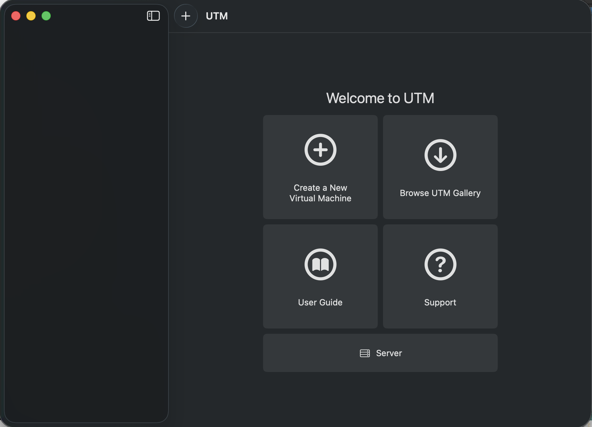
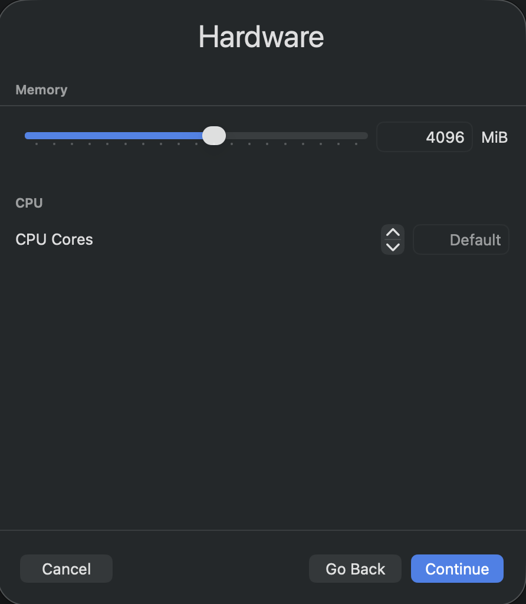
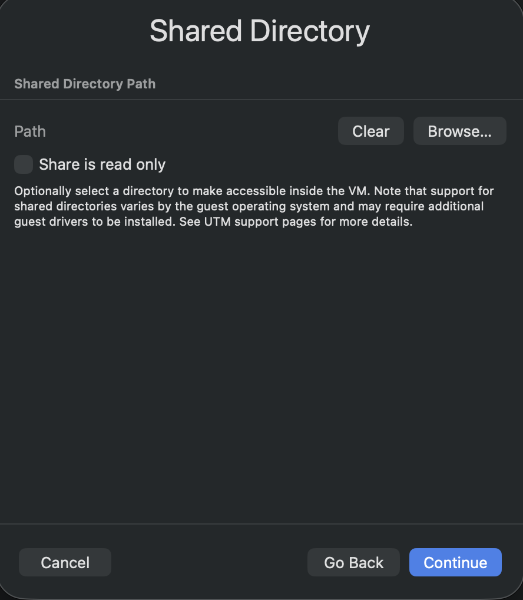
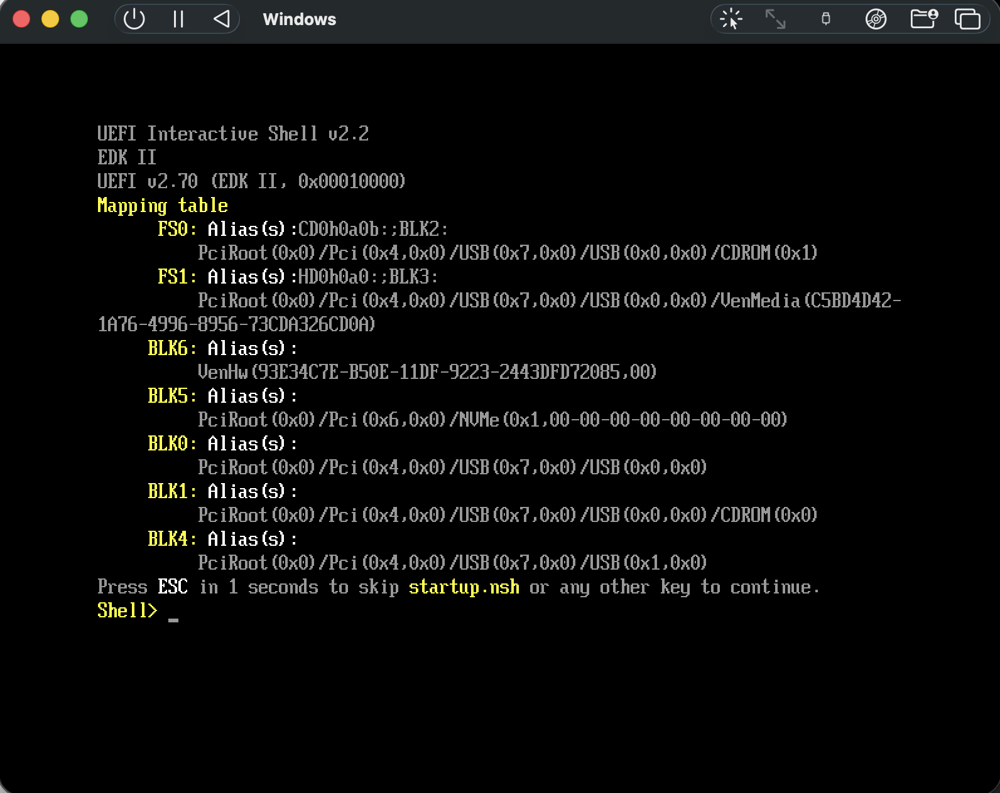
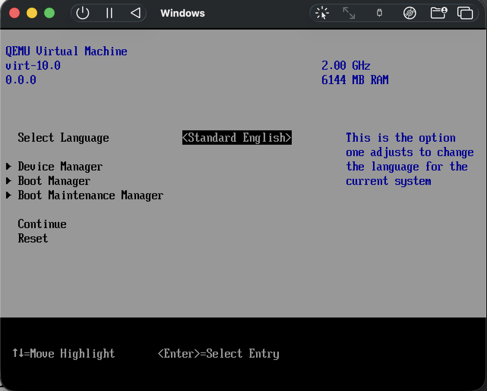
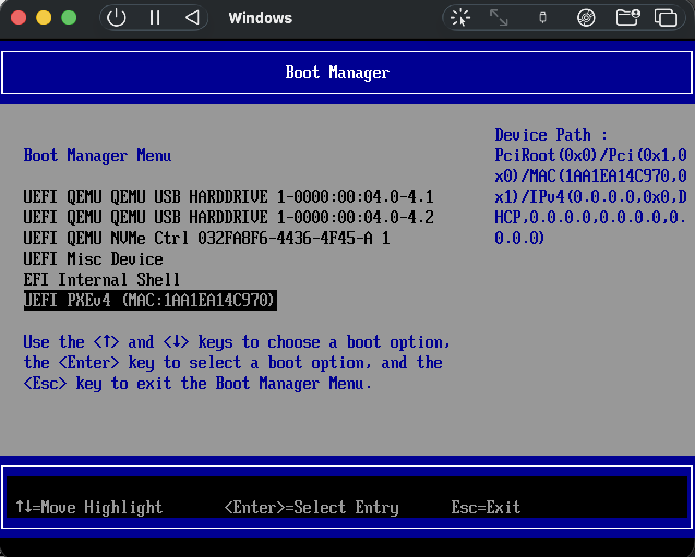
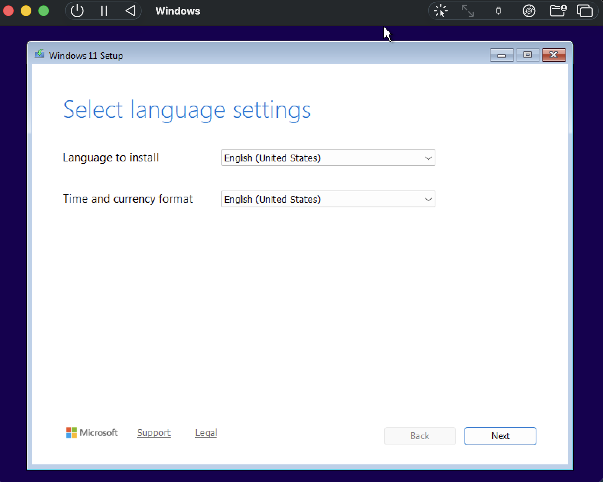
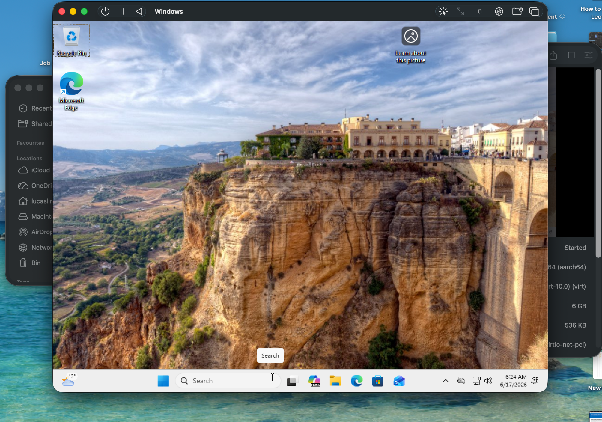

# Day 1 - UTM Windows 11 ARM Setup

## Goal

Set up a Windows 11 ARM64 virtual machine using UTM on macOS.

## Configuration

* OS: Windows 11 ARM64
* Hypervisor: UTM
* RAM: 6144 MiB (6 GB)
* CPU: 4 Cores
* Storage: 80 GB

## What I Did

1. Downloaded the Windows 11 ARM64 ISO from Microsoft.
2. Created a new Windows virtual machine in UTM.

3. Configured memory, CPU, and storage allocations.

4. Configured a shared directory between host and guest.

5. Started the virtual machine and attempted installation.
6. Troubleshot boot issues.
7. Installed Windows 11 Pro successfully.

## Problems Encountered

### EFI Shell Boot Error

The virtual machine booted into the EFI shell instead of the Windows installer.

## Resolution

The issue occurred because an x64 Windows ISO was initially used. The ISO was replaced with the correct Windows 11 ARM64 version and the VM was recreated.

Working through the UEFI boot manager to identify the problem:

With the correct ARM64 ISO attached, the Windows installer loaded:

## Result

Windows 11 ARM64 installed successfully and booted to the desktop environment.

## Next Steps

* Install Python
* Install Wireshark
* Install project dependencies
* Configure development environment
* Begin project-specific setup