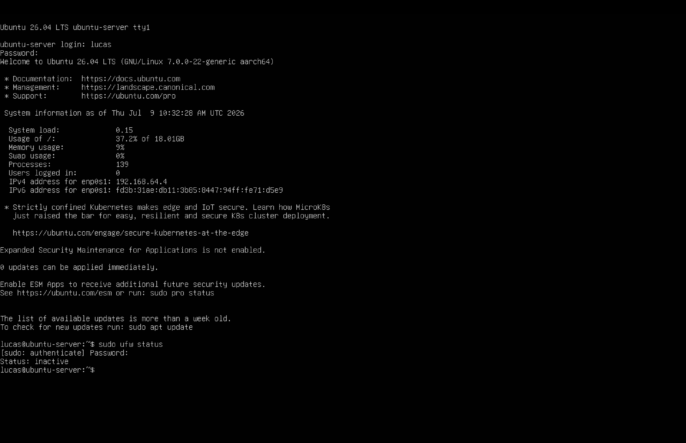
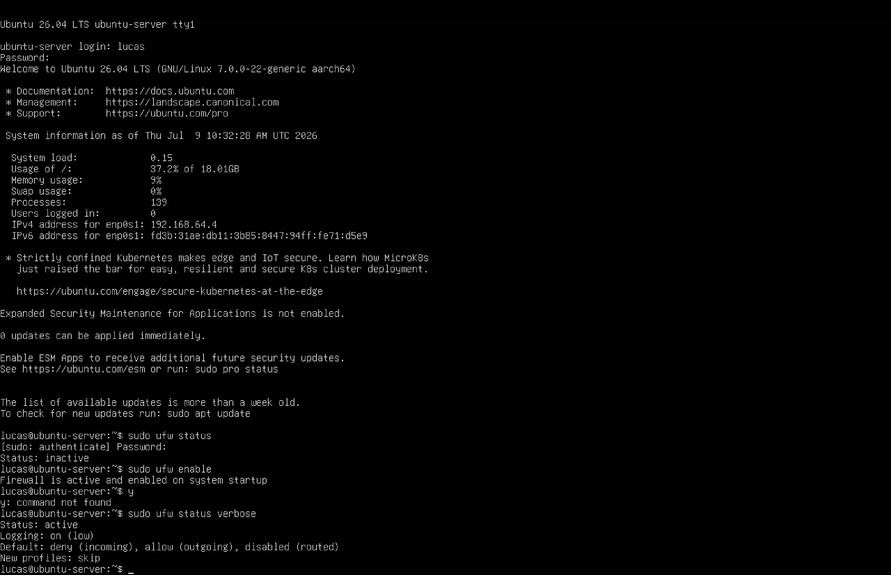
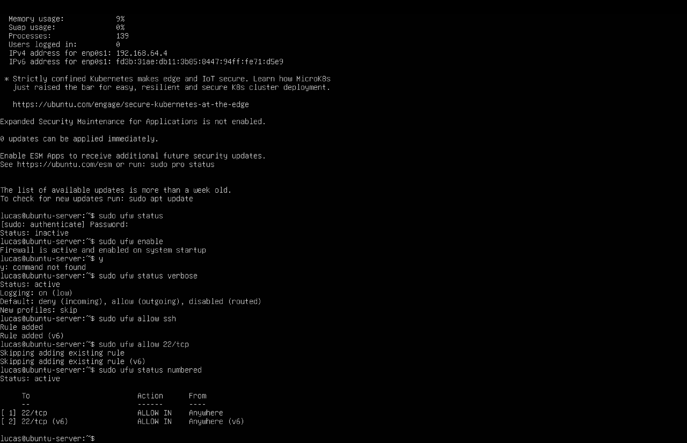
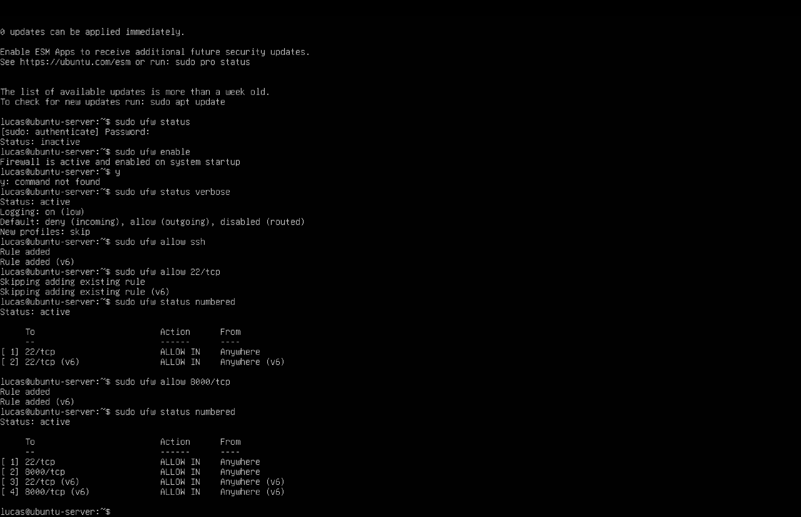
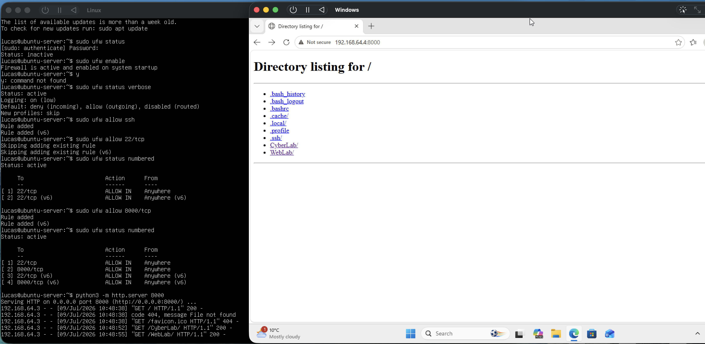
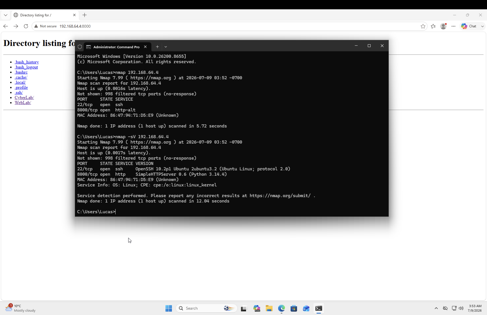
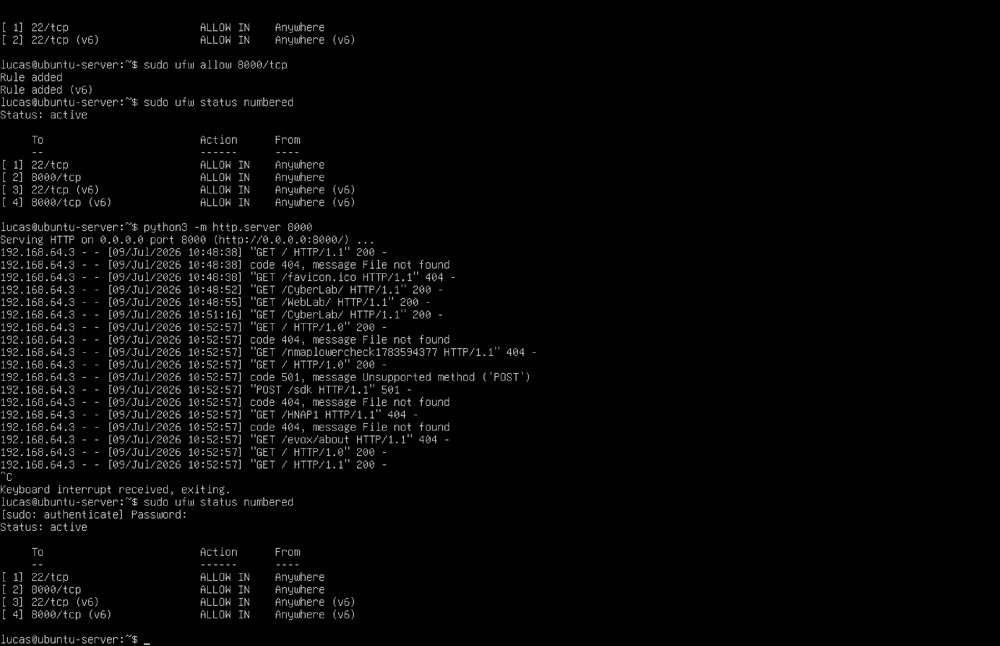
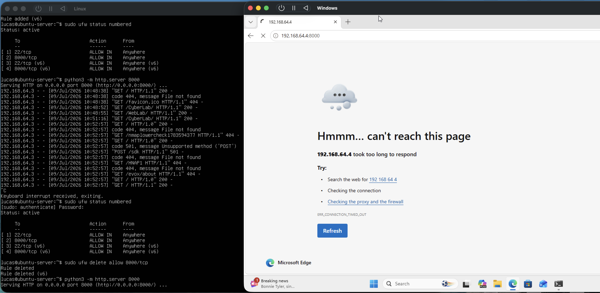
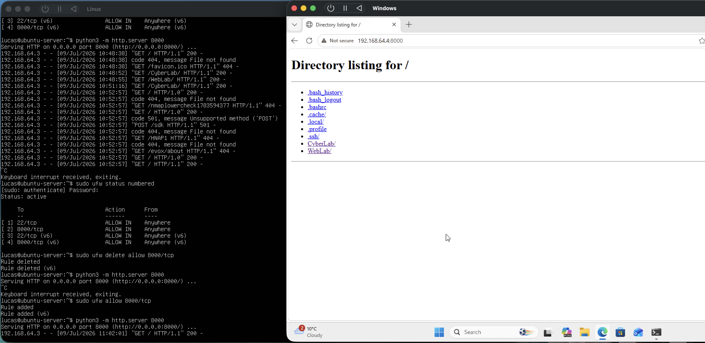

# Day 10 – Linux Firewall & Service Hardening

## Objective

The objective of this lab was to learn how to secure a Linux server using UFW (Uncomplicated Firewall). I configured firewall rules, verified service accessibility from another machine, tested connectivity using Nmap, and observed how firewall rules affect network access.

---

## Environment

- Host: MacBook (Apple Silicon), macOS
- Hypervisor: UTM
- Server VM: Ubuntu Server (target)
- Client VM: Windows 11 ARM64
- Network: UTM shared network, `192.168.64.0/24`
- Tools: UFW (Uncomplicated Firewall), Python 3 HTTP Server, Nmap

---

## What I Completed

### 1. Checked Firewall Status

Verified the current status of UFW.

Command used:

```bash
sudo ufw status
```

Initially, the firewall was inactive.



---

### 2. Enabled the Firewall

Enabled UFW and verified its configuration.

Commands used:

```bash
sudo ufw enable
```

```bash
sudo ufw status verbose
```

The firewall became active with the default policy:

- Deny incoming connections
- Allow outgoing connections



---

### 3. Allowed SSH Access

Configured the firewall to allow SSH connections.

Command used:

```bash
sudo ufw allow 22/tcp
```

Verified the rule using:

```bash
sudo ufw status numbered
```



---

### 4. Allowed HTTP Traffic

Allowed inbound connections to the Python HTTP server.

Command used:

```bash
sudo ufw allow 8000/tcp
```

Verified that the rule was successfully added.



---

### 5. Tested Web Server Connectivity

Started the Python HTTP server.

Command used:

```bash
python3 -m http.server 8000
```

From the Windows VM, accessed:

```
http://192.168.64.4:8000
```

The webpage loaded successfully, confirming that the firewall allowed HTTP traffic on port 8000.



---

### 6. Verified Open Ports with Nmap

From the Windows VM, scanned the Ubuntu server.

Commands used:

```bash
nmap 192.168.64.4
```

and

```bash
nmap -sV 192.168.64.4
```

Nmap identified:

- Port 22 (SSH)
- Port 8000 (HTTP)

Service detection also identified:

- OpenSSH
- Python SimpleHTTPServer



---

### 7. Reviewed Firewall Rules

Displayed the configured firewall rules.

Command used:

```bash
sudo ufw status numbered
```

Confirmed that only the required services were allowed.



---

### 8. Tested Firewall Blocking

Stopped the HTTP server and removed the HTTP firewall rule.

Command used:

```bash
sudo ufw delete allow 8000/tcp
```

Restarted the HTTP server and attempted to access the webpage from Windows.

The connection failed because the firewall blocked incoming traffic on port 8000, demonstrating that the service can be running while remaining inaccessible due to firewall policy.



---

### 9. Restored HTTP Access

Re-added the HTTP firewall rule.

Command used:

```bash
sudo ufw allow 8000/tcp
```

Refreshed the webpage from Windows and confirmed that access was restored.



---

## Key Concepts Learned

- UFW is Ubuntu's firewall management tool.
- Firewalls control which network traffic is permitted.
- Services must be explicitly allowed through the firewall.
- A running service does not guarantee network accessibility.
- Nmap can verify which ports are exposed.
- Reducing exposed services decreases the attack surface.
- The Principle of Least Privilege recommends exposing only required services.

---

## Skills Practiced

- Linux command line
- UFW firewall configuration
- Managing firewall rules
- Network service hardening
- Port management
- Nmap scanning
- Cross-machine connectivity testing
- Basic Linux administration

---

## Reflection

This lab demonstrated how firewall rules directly affect service accessibility. I learned that simply running a service is not enough—network access must also be permitted by the firewall. By allowing only SSH and HTTP while blocking unnecessary ports, I applied the Principle of Least Privilege and gained practical experience with basic Linux system hardening and network security.