# Day 12 – Secure Remote Access with SSH

## Objective

Learn how Secure Shell (SSH) provides encrypted remote administration by:

- Installing and enabling OpenSSH Server on Ubuntu
- Verifying SSH is listening on the network
- Connecting remotely from Windows
- Capturing and analysing the SSH handshake in Wireshark
- Observing how SSH encrypts all communication after authentication

---

## Environment

**Host Machine**
- MacBook (Apple Silicon), macOS
- Hypervisor: UTM

**Virtual Machines**
- Windows 11 ARM64 (client)
- Ubuntu Server 26.04 LTS (server)

**Network**
- UTM shared network, `192.168.64.0/24`
- Ubuntu IP: `192.168.64.4`

**Tools Used**
- OpenSSH Server
- OpenSSH Client (Windows)
- Nmap
- Wireshark
- Windows PowerShell
- Ubuntu Terminal

---

# Part 1 – Install and Verify SSH Server

Updated the Ubuntu system and installed the OpenSSH Server package.

```bash
sudo apt update
sudo apt install openssh-server
```

Verified the SSH service was running.

```bash
sudo systemctl status ssh
```

Result:

- SSH service was active.
- Server listening on TCP Port 22.

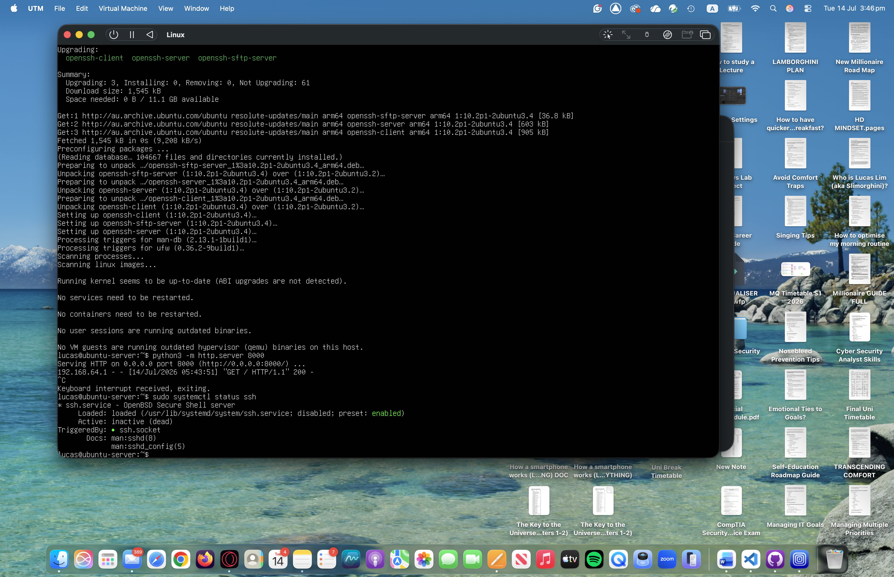

---

# Part 2 – Verify SSH with Nmap

From the Windows machine, scanned the Ubuntu server.

```bash
nmap 192.168.64.4
```

Result:

- Host detected
- Port 22/tcp open (SSH)
- Port 8000/tcp open (HTTP)

This confirmed the SSH service was accessible across the network.

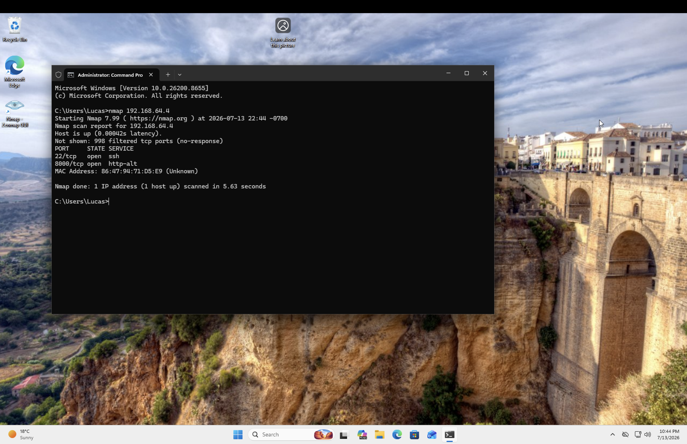

---

# Part 3 – Connect using SSH

Connected from Windows PowerShell.

```powershell
ssh lucas@192.168.64.4
```

During the first connection:

- Windows displayed the server fingerprint.
- Verified and accepted the fingerprint.
- The server was added to the known_hosts file.

After entering the Ubuntu password, a secure shell session was established.

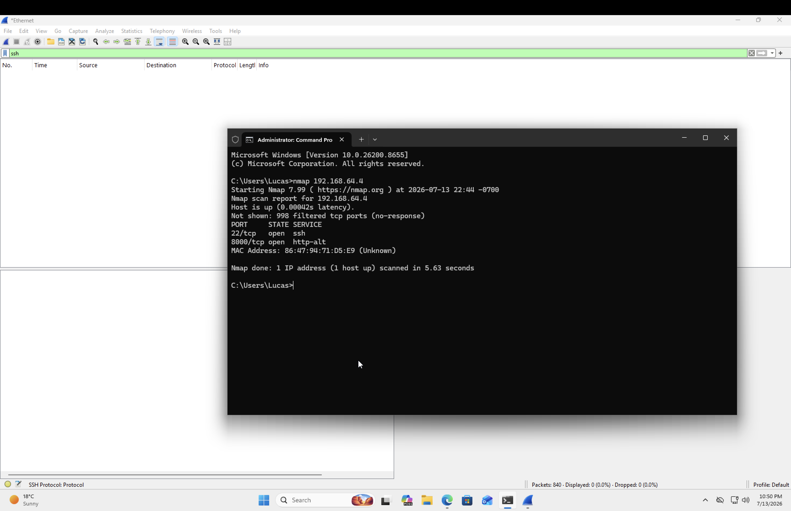

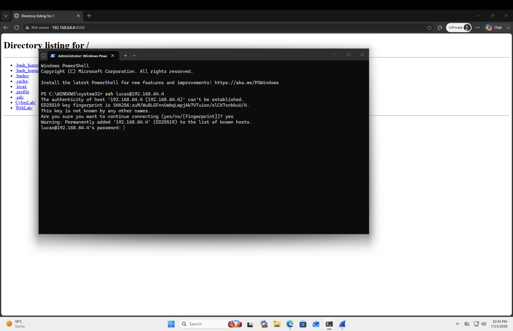

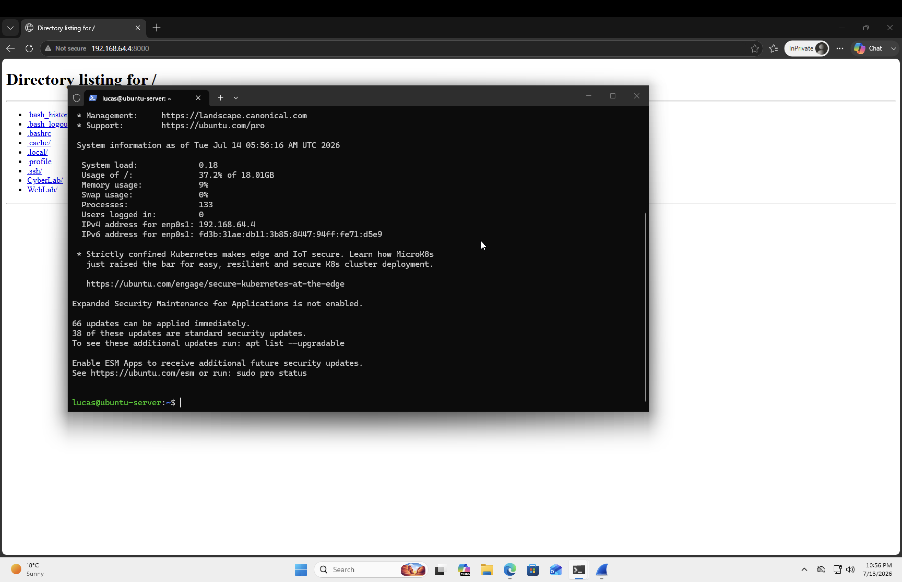

---

# Part 4 – Capture SSH Traffic

Started a packet capture in Wireshark before initiating the SSH connection.

Applied the display filter:

```
ssh
```

Captured the complete SSH session including:

- Protocol version exchange
- Key exchange
- Encryption negotiation
- Encrypted traffic

---

# Part 5 – Analyse the SSH Handshake

## Protocol Version Exchange

The client introduced itself:

```
SSH-2.0-OpenSSH_for_Windows_9.5
```

The Ubuntu server replied:

```
SSH-2.0-OpenSSH_10.2p1 Ubuntu
```

This confirmed both systems agreed on SSH Version 2.

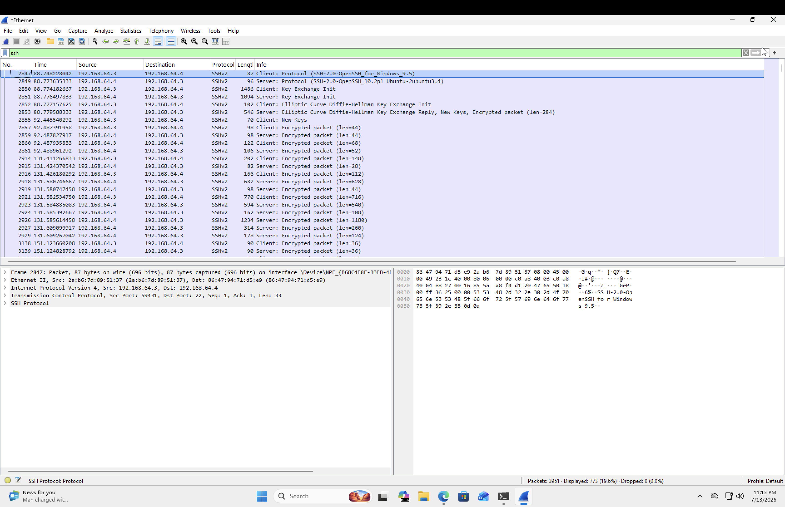


---

## Key Exchange

Wireshark showed the following packets:

- Key Exchange Init
- Elliptic Curve Diffie-Hellman Key Exchange
- New Keys

During this process:

- Client and server negotiated supported encryption algorithms.
- A shared secret session key was generated.
- The encryption keys were never transmitted across the network.

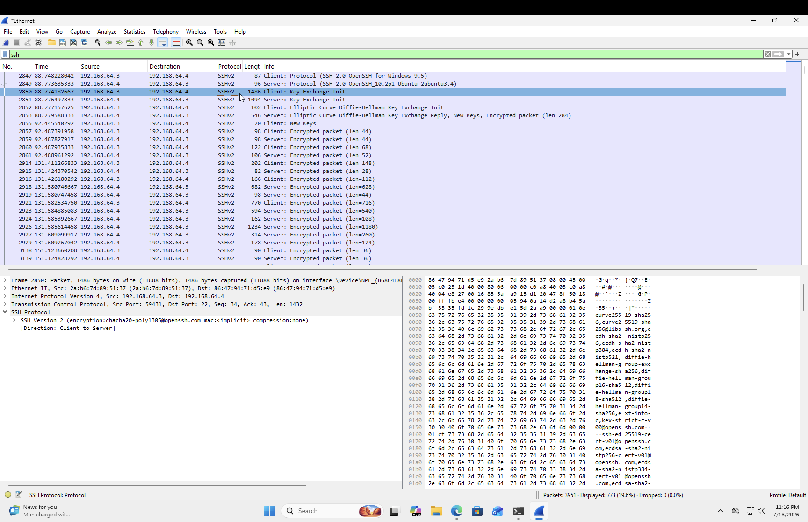

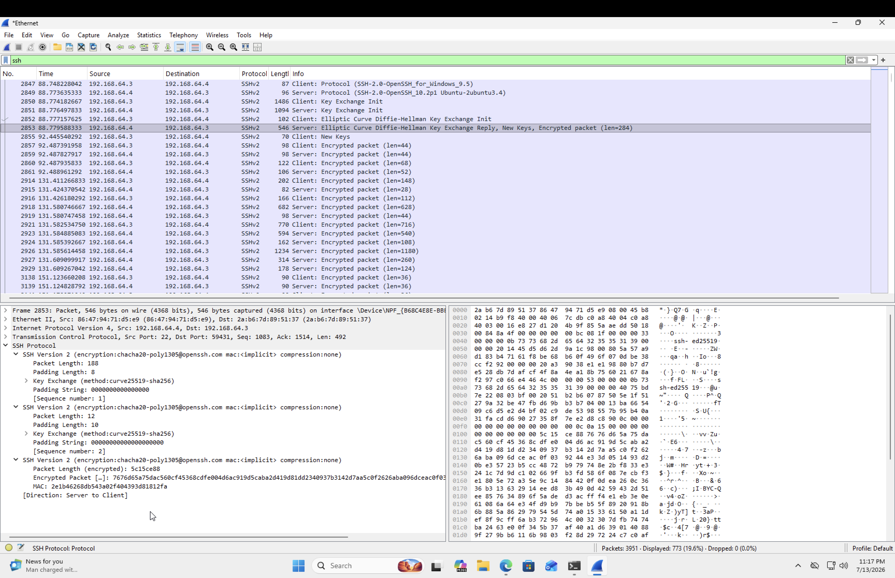

---

## Encrypted Session

Immediately after the key exchange:

Wireshark displayed only encrypted packets.

Unlike HTTP, the packet payload could no longer be read.

Only metadata such as:

- Source IP
- Destination IP
- Packet length
- Timing

remained visible.

The commands, passwords, and server responses were fully encrypted.

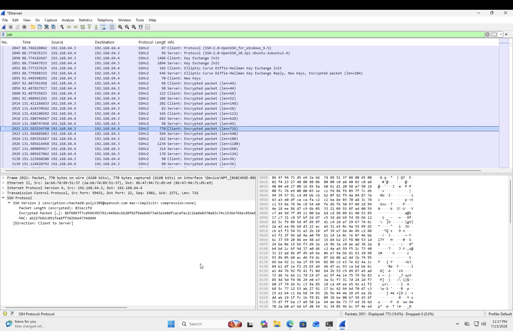

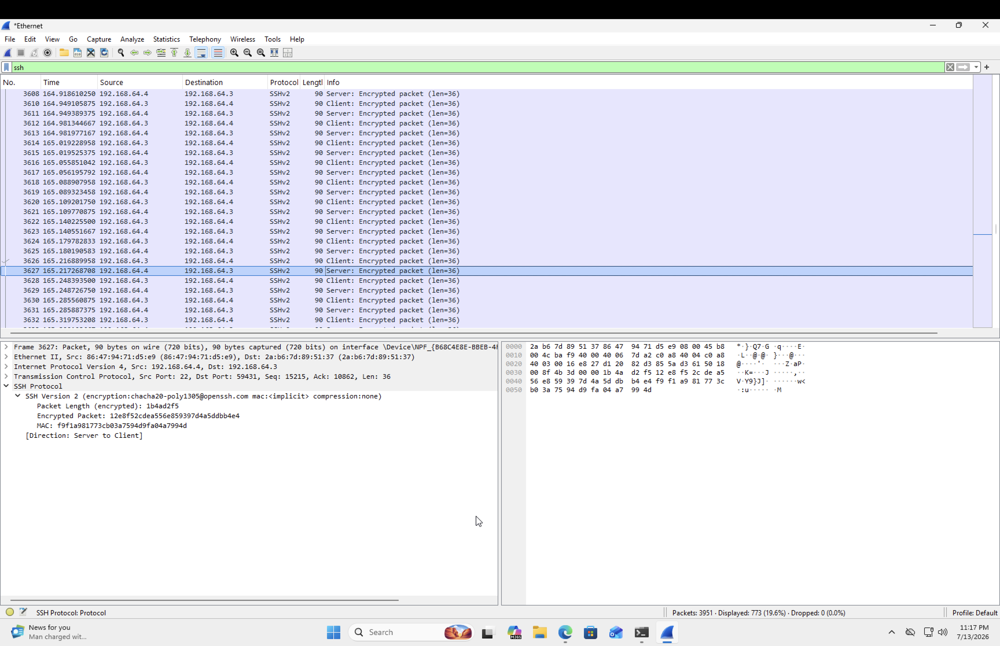

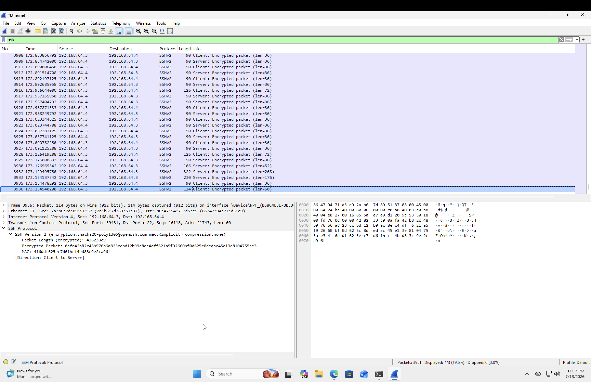

---

# Key Concepts Learned

## SSH

SSH (Secure Shell) is a secure remote administration protocol that encrypts all communication between a client and server.

---

## Port 22

SSH uses TCP Port 22 by default.

---

## Host Fingerprint

When connecting for the first time:

- The client verifies the server identity.
- The fingerprint helps prevent connecting to an attacker pretending to be the server.

---

## Key Exchange

SSH uses public key cryptography to securely establish a shared session key before communication begins.

---

## Symmetric Encryption

After authentication:

SSH switches to fast symmetric encryption for the remainder of the session.

This protects:

- Commands
- Passwords
- Terminal output
- File transfers

---

## Packet Visibility

Unlike HTTP:

SSH packet contents cannot be inspected in Wireshark because they are encrypted.

Only packet metadata remains visible.

---

# What I Learned

During this lab I learned how SSH securely replaces insecure remote administration methods.

I successfully:

- Installed and configured OpenSSH Server
- Verified the SSH service with Nmap
- Connected remotely from Windows
- Verified host fingerprint authentication
- Analysed the SSH handshake in Wireshark
- Observed protocol version negotiation
- Observed Elliptic Curve Diffie-Hellman key exchange
- Confirmed that all subsequent traffic becomes encrypted

This demonstrated how SSH provides confidentiality, integrity, and secure remote administration across a network.

---

