# Day 14 – Active Directory Domain Services on Windows Server (Azure)

## Objective

Stand up a Windows Server domain controller and build a small Active Directory environment from scratch. Up to this point the lab ran locally in UTM, but Windows Server is impractical to virtualise on Apple Silicon, so this stage moved to a Windows Server 2025 VM in Microsoft Azure, administered over RDP from macOS.

The goals were to:

- Provision a Windows Server 2025 VM in Azure and connect to it from a Mac
- Install the Active Directory Domain Services (AD DS) role
- Promote the server to a domain controller by creating a new forest
- Verify the domain controller and its integrated DNS
- Build an organisational structure using nested Organizational Units (OUs)
- Create users, create security groups, and assign group membership

---

## Environment

**Cloud platform**
- Microsoft Azure (free trial, US$200 credit)
- Resource group: `HomeLab-RG`
- Region: Australia East

**Server VM**
- Windows Server 2025 Datacenter: Azure Edition (x64, Gen2)
- VM name: `DC01`
- Size: Standard_B2ls_v2 (2 vCPU, 4 GiB RAM, about US$45/month)
- OS disk: 127 GiB Premium SSD
- Administrator username: `lucasadmin`
- Roles added during the lab: Active Directory Domain Services, DNS

**Networking**
- Virtual network: `vnet-australiaeast-1`, subnet `172.16.0.0/24`
- Private IP: `172.16.0.4` (static)
- Public IP: `DC01-ip` (`4.196.156.147`)
- Inbound: RDP (TCP 3389), restricted to my own public IP via the NSG

**Domain**
- Forest root domain: `lucaslab.test`
- NetBIOS name: `LUCASLAB`
- Forest and domain functional level: Windows Server 2025

**Client**
- MacBook (Apple Silicon)
- Microsoft Remote Desktop, connecting via a downloaded `.rdp` file

**Tools used**
- Azure Portal
- Microsoft Remote Desktop (macOS)
- Server Manager
- Active Directory Domain Services Configuration Wizard
- Active Directory Users and Computers (ADUC)

A note on the domain name: `lucaslab.test` uses the `.test` top-level domain, which is reserved for testing under RFC 6761 and will never resolve on the public internet. That makes it a safer lab choice than `.local`, which Microsoft discourages because it can collide with multicast DNS.

---

## Part 1 – Provision the Windows Server VM in Azure

Signed in to the Azure Portal on a free trial with US$200 of credit, then created the VM through Virtual machines and Create.

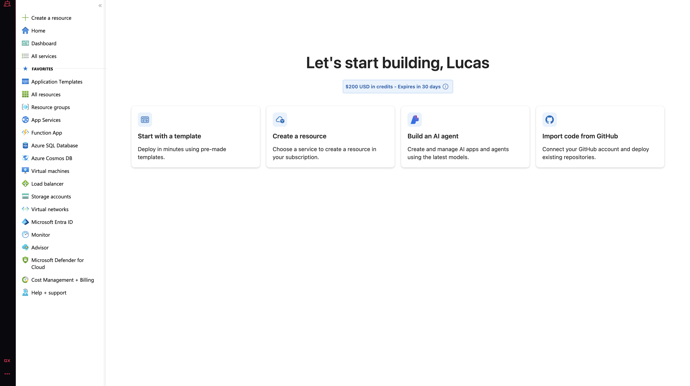

Final configuration:

- Resource group: `HomeLab-RG` (new)
- VM name: `DC01`
- Region: Australia East
- Image: Windows Server 2025 Datacenter: Azure Edition, x64, Gen2
- Security type: Trusted launch
- Size: Standard_B2ls_v2 (2 vCPU, 4 GiB, about US$45/month)
- Administrator account: username `lucasadmin` with a password (RDP uses password authentication rather than SSH keys)
- OS disk: 127 GiB Standard SSD, platform-managed key
- Virtual network: `vnet-australiaeast-1` with subnet `172.16.0.0/24`
- Public IP: `DC01-ip`
- Inbound port: RDP (TCP 3389)

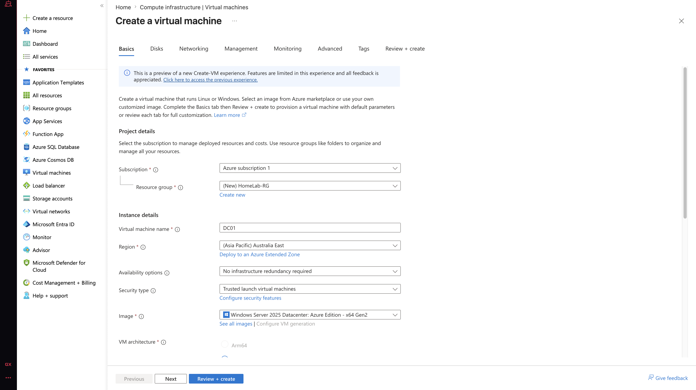

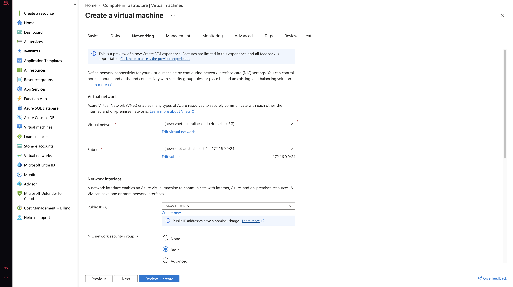

To keep the trial credit under control, auto-shutdown was enabled at 23:00 AEST, the OS disk was left as Standard SSD rather than Premium, and the public IP and NIC were set to delete with the VM. Every resource was tagged consistently with `Environment=HomeLab`, `Role=DomainController`, and `Project=ActiveDirectoryLab`. Because this is Windows Server 2025 Azure Edition, hotpatching was left enabled with Azure-orchestrated patching, which lets many security updates apply without a reboot.

The deployment completed successfully on 20 July 2026.

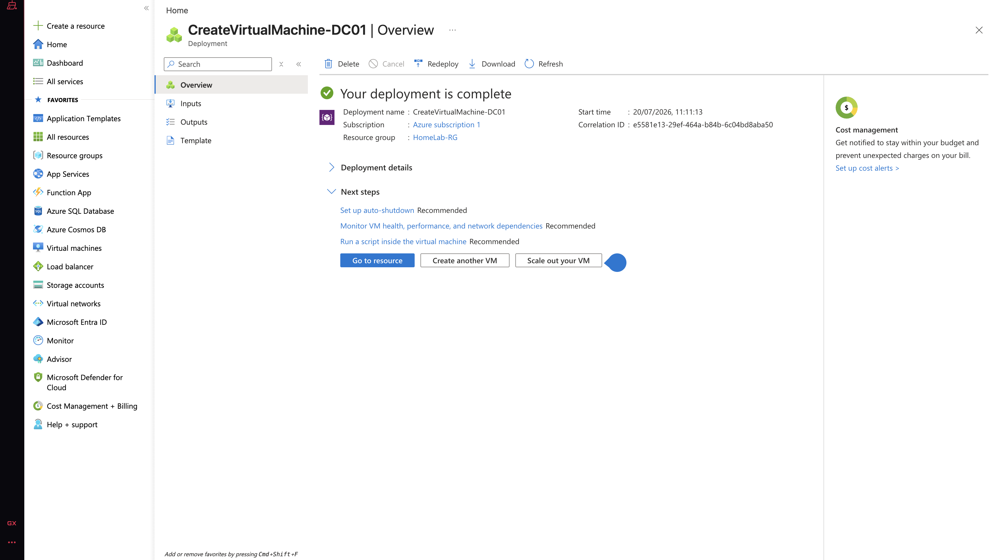

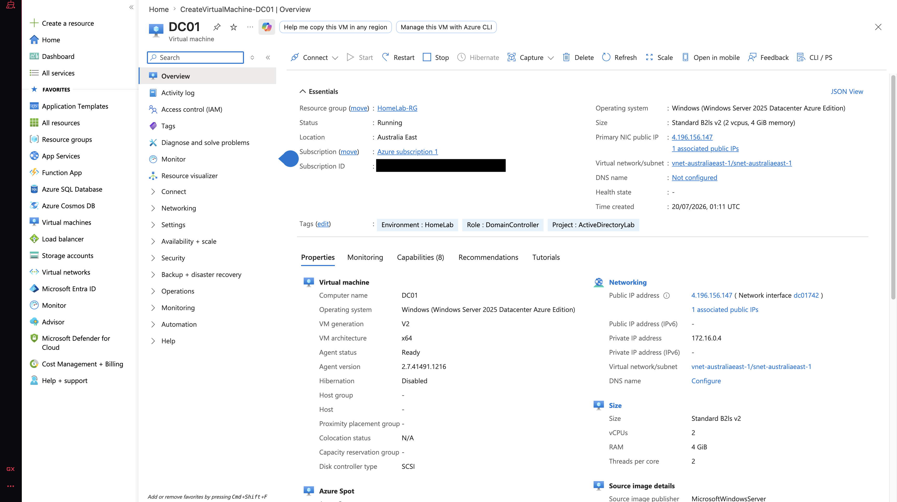

### Problems encountered

Two issues came up during provisioning.

First, the initial attempt used an Ubuntu Server image in the East US region at size Standard_D2s_v3. Azure rejected that size with `NotAvailableForSubscription`, meaning the trial subscription had no quota for it in that region. Rather than request a quota increase, I switched the region to Australia East, which is also lower latency from Sydney, and changed the image to Windows Server 2025. I then chose a B-series size that was available and stepped it down from Standard_B2s_v2 to Standard_B2ls_v2 to reduce the hourly cost and preserve trial credit.

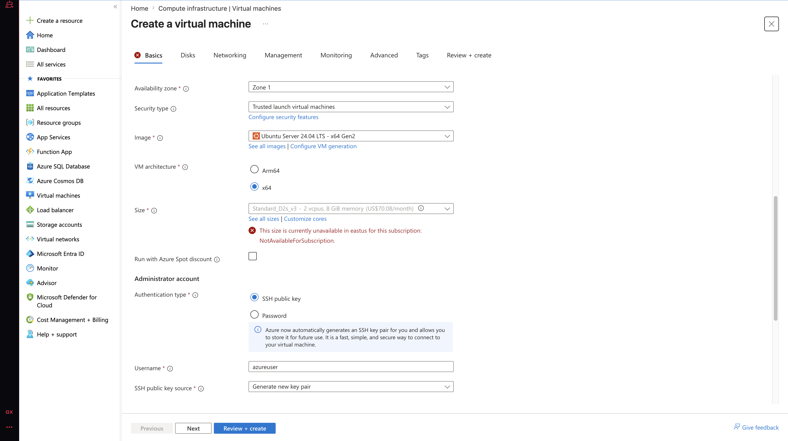

Second, at Review and create the deployment failed validation with `SecurityRuleParametersMissing`. I had added a custom inbound rule named `Allow-RDP-MyIP` to restrict RDP to my own address, but had not filled in the source, so the rule had no `SourceAddressPrefix`. I removed the incomplete rule to let the VM deploy, then re-created it correctly against the running VM. That fix is covered in Part 2.

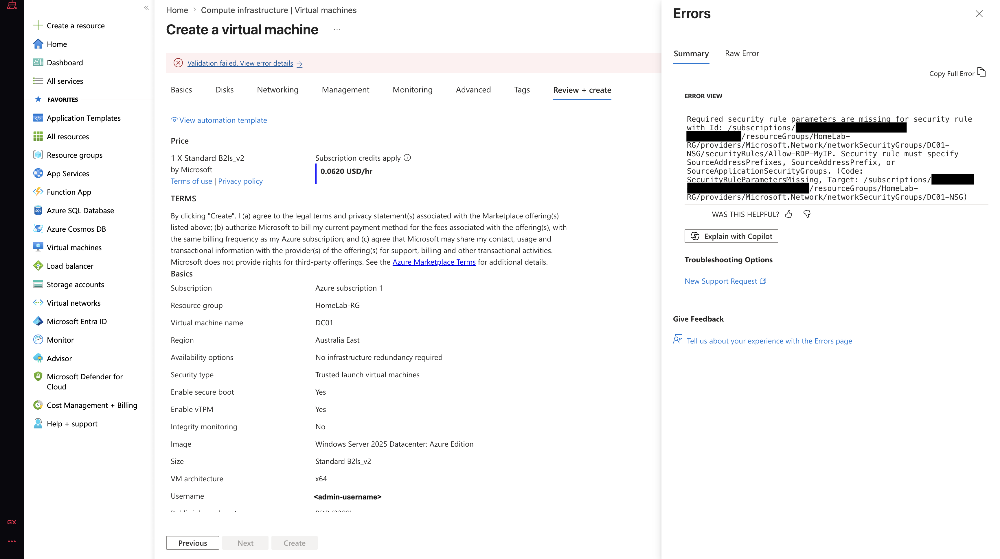

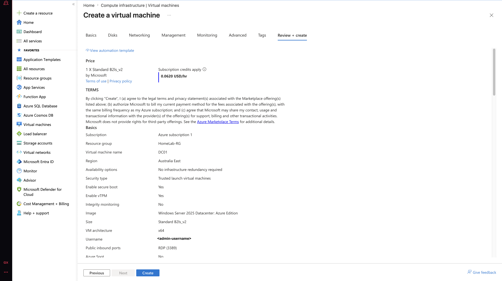

---

## Part 2 – Secure the connection and log in over RDP

### Set a static private IP

Before connecting, I changed the network interface's private IP allocation from Dynamic to Static, fixing it at `172.16.0.4`. A domain controller needs a stable address because clients locate the domain and its DNS through that IP, and a lease change could break name resolution. In Azure this is set on the NIC in the portal rather than inside Windows, so the guest keeps receiving its address from Azure.

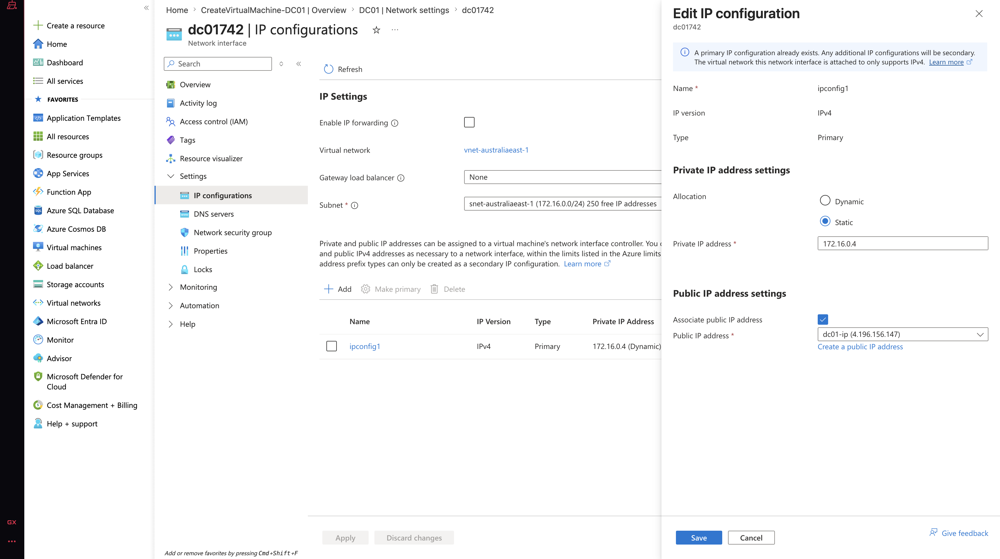

### First connection failed

The VM's public IP was `4.196.156.147`. I downloaded the `.rdp` file from the **Connect** blade and opened it in Microsoft Remote Desktop on the Mac, but the first attempt failed with error `0x204` (the client could not reach the host).

The cause was network security rules. After removing the incomplete `Allow-RDP-MyIP` rule during creation, the VM had deployed with no inbound rule permitting RDP, so Azure's default deny blocked the connection.

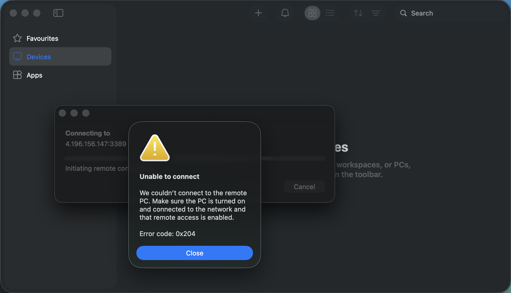

### Lock RDP to my own IP, then connect

I looked up my home public IP, then added an inbound rule to the VM's network security group:

- Name: `Allow-RDP-MyIP`
- Priority: 300
- Port: 3389, Protocol: TCP
- Source: my own public IP only
- Action: Allow

This is the security-conscious version of the rule that failed validation earlier. RDP is reachable only from my location rather than the whole internet, which removes the VM from constant internet-wide brute-force attempts. The tradeoff is that the rule needs updating if my home IP changes.

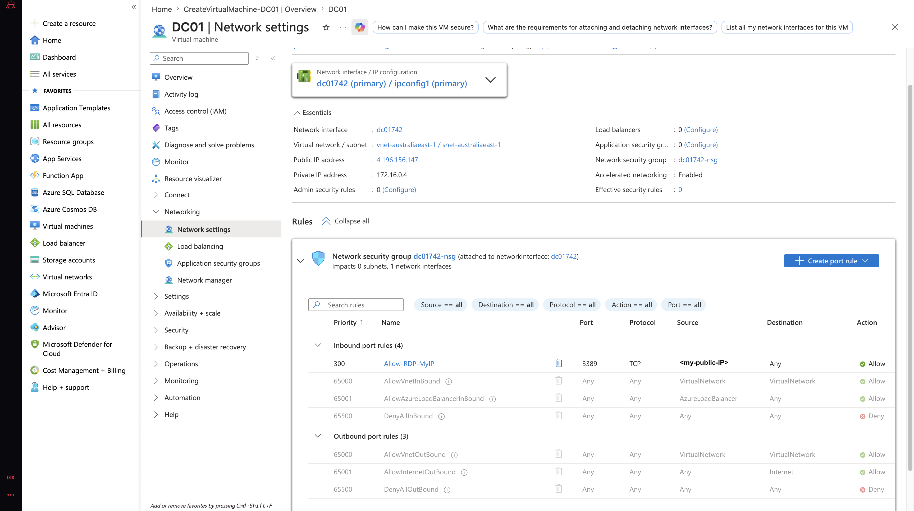

With the rule in place I reconnected, completed the Windows first-login prompts, and reached the desktop with Server Manager open. At this point Server Manager showed a single role (File and Storage Services), confirming the base server was ready for the AD DS role to be added.

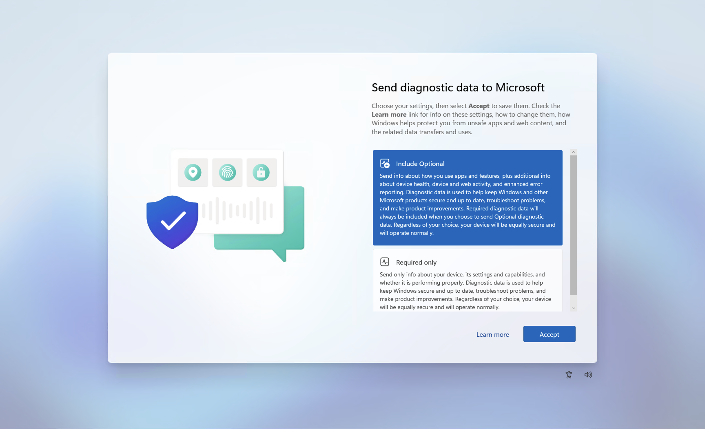

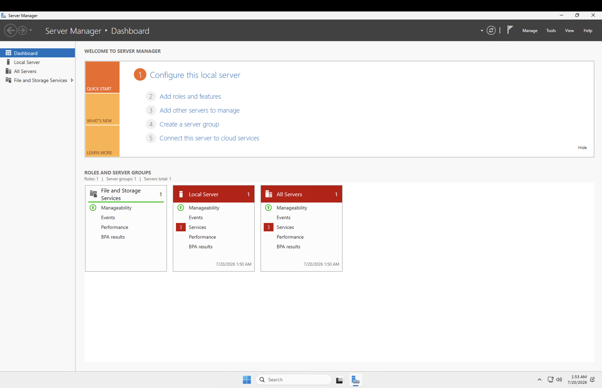

---

## Part 3 – Install the AD DS role

In Server Manager, used **Add roles and features** to install Active Directory Domain Services.

1. Chose a role-based installation.
2. Selected the local server (`DC01`) as the target.
3. Ticked **Active Directory Domain Services** and accepted the additional management features it prompted for.
4. Completed the installation. DNS is not installed at this stage; it is added during promotion.

---

## Part 4 – Promote DC01 to a domain controller

After the role installed, opened the promotion wizard from the Server Manager notification flag.

### Deployment configuration

Selected **Add a new forest** and set the root domain name to `lucaslab.test`. This is the option that creates a brand new directory rather than joining an existing one.

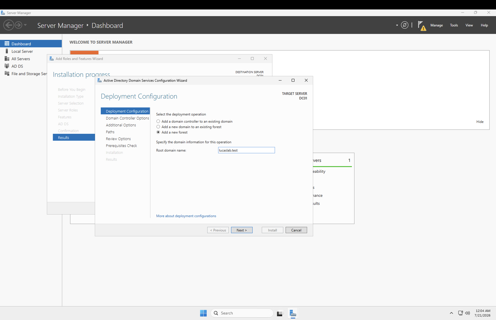

### Domain controller options

- Forest functional level: Windows Server 2025
- Domain functional level: Windows Server 2025
- Enabled **Domain Name System (DNS) server**
- Enabled **Global Catalog (GC)**
- Left **Read only domain controller (RODC)** unticked
- Set the Directory Services Restore Mode (DSRM) password

The DSRM password is a standalone recovery password used to boot the DC into a special repair mode. It is separate from the domain administrator password and is easy to forget, so it is worth storing safely.

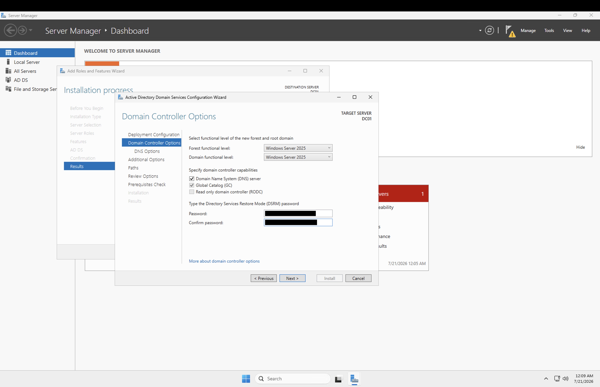

### NetBIOS name

The wizard derived the NetBIOS domain name `LUCASLAB` from the root domain and left it unchanged.

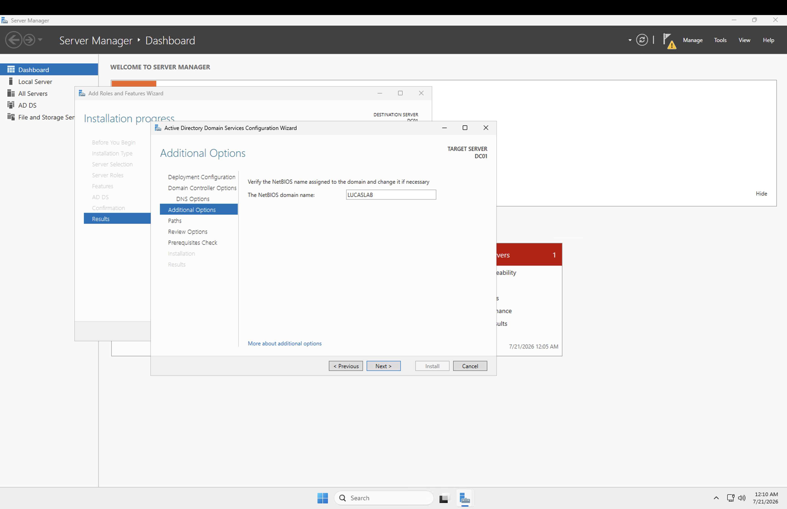

### Prerequisites check

The check passed. It raised the expected warning that a DNS delegation could not be created, which is normal when standing up a brand new forest with no parent DNS zone above it and needs no action in a lab. The check also recommended a static IP address. In Azure this is handled at the network interface in the portal rather than inside the guest OS, so it should not be set manually inside Windows.

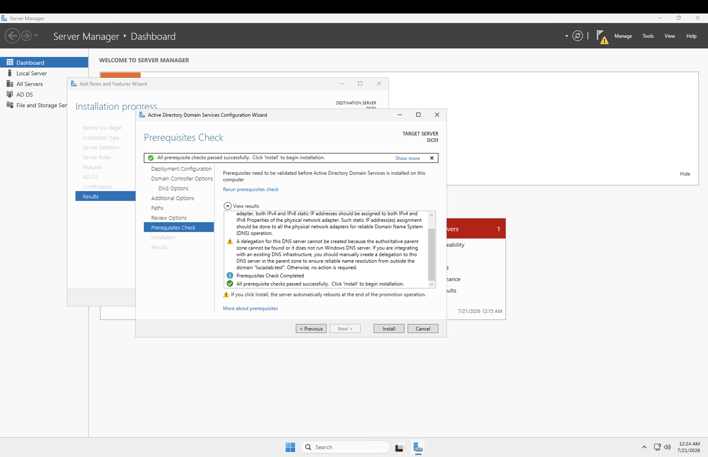

Clicking **Install** promoted the server and rebooted it automatically. After reconnecting over RDP, the login was now against the `LUCASLAB` domain.

---

## Part 5 – Verify the domain controller

After promotion, Server Manager showed three roles: AD DS, DNS, and File and Storage Services. DNS appearing here confirms it was installed and integrated during promotion.

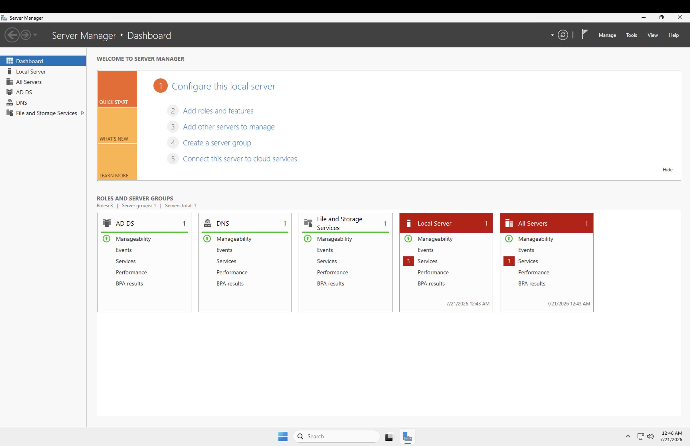

Opened **Active Directory Users and Computers** from Tools and confirmed `DC01` sitting in the **Domain Controllers** container, listed as a Global Catalog server in the default site.

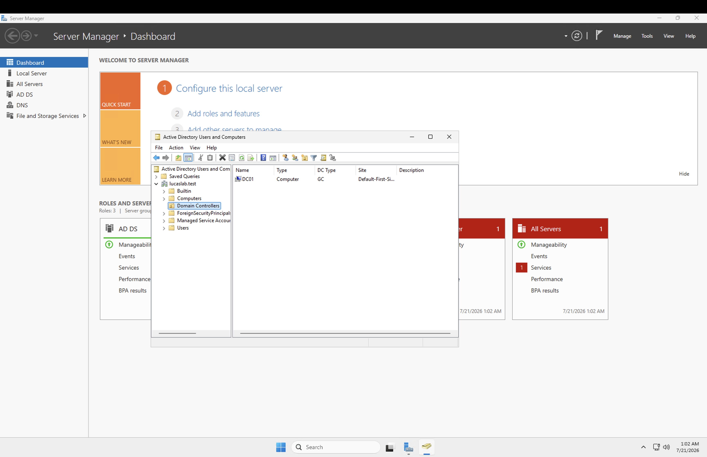

---

## Part 6 – Build the organisational structure

Rather than dropping everything into the default containers, created a top-level OU named **LucasLab** and nested department and resource OUs inside it:

```
lucaslab.test
└── LucasLab
    ├── IT
    ├── HR
    ├── Sales
    ├── Groups
    ├── Computers
    └── Servers
```

Nesting OUs this way mirrors how a real domain is organised. It keeps departments separate, gives a clean place to apply Group Policy later, and makes delegating control over a single department straightforward.

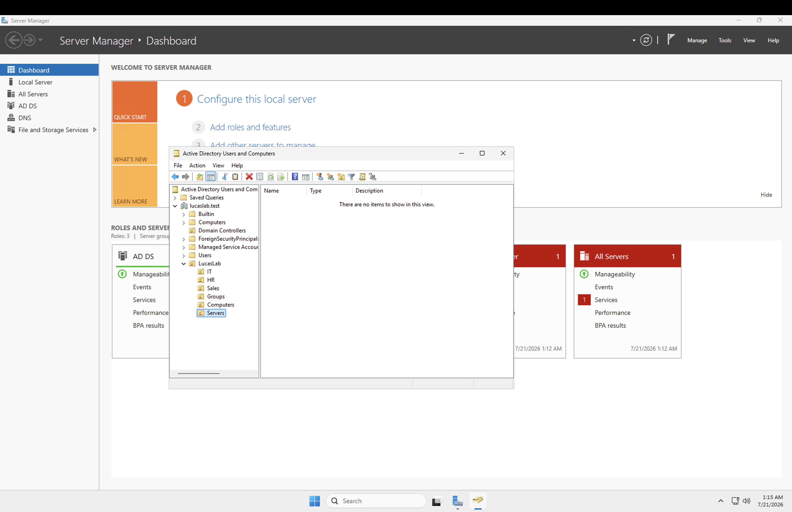

---

## Part 7 – Create users

Created one user in each department OU.

| User | Department OU |
|------|---------------|
| John Smith | IT |
| Alice Chen | HR |
| Bob Wilson | Sales |


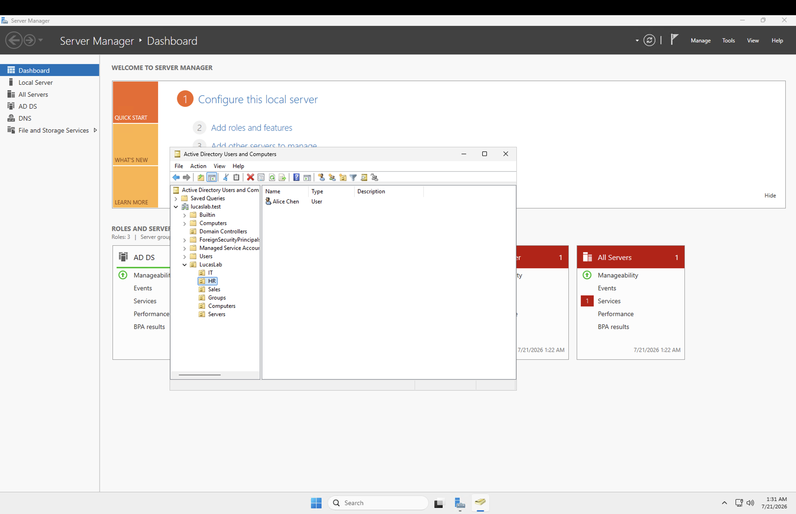


---

## Part 8 – Create security groups

Created three security groups inside the **Groups** OU:

- `GG_IT_Staff`
- `GG_HR_Staff`
- `GG_Sales_Staff`

The `GG_` prefix marks these as global groups. Naming groups by role and keeping them in their own OU follows the common approach of grouping users by function first, then granting those groups access to resources. It scales far better than assigning permissions to individual users.


---

## Part 9 – Assign group membership

Added each user to the group for their department:

| Group | Member |
|-------|--------|
| GG_IT_Staff | John Smith |
| GG_HR_Staff | Alice Chen |
| GG_Sales_Staff | Bob Wilson |

Verified membership by opening the **Members** tab of `GG_Sales_Staff`, which showed Bob Wilson listed with his source OU path `lucaslab.test/LucasLab/Sales`.

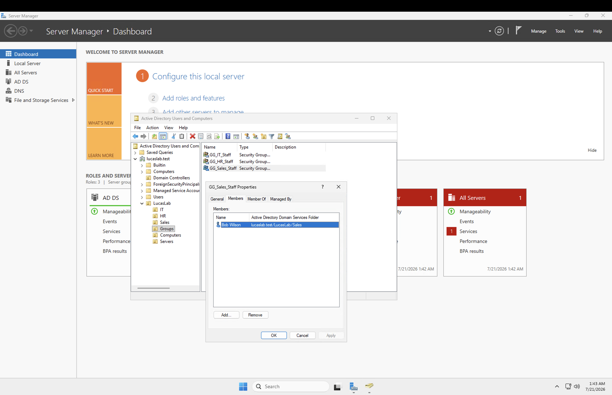

---

## Key Concepts Learned

- **Forest, domain, and domain controller.** A forest is the top of the Active Directory structure, a domain lives inside it, and a domain controller is the server that hosts and serves the directory.
- **AD DS depends on DNS.** DNS is installed alongside AD DS during promotion because clients locate domain controllers through DNS service records.
- **Global Catalog.** A GC holds a searchable partial copy of every object in the forest, which is what lets logons and directory searches work across the whole forest.
- **DSRM password.** A separate recovery credential for booting a domain controller into repair mode, distinct from the domain administrator account.
- **Organizational Units.** OUs organise objects and act as the boundary for applying Group Policy and delegating administration. Nesting them models a real organisation.
- **Users and security groups.** Assigning permissions to groups rather than individual users is the standard, scalable approach to access control.
- **Group naming conventions.** A prefix such as `GG_` communicates group type and purpose at a glance and keeps a large directory readable.

---

## Skills Practised

- Provisioning a Windows Server VM in Microsoft Azure
- Remote administration of Windows Server over RDP from macOS
- Installing server roles with Server Manager
- Promoting a server to a domain controller and creating a new forest
- Configuring integrated DNS during domain controller promotion
- Designing and building a nested OU structure
- Creating and organising domain users
- Creating security groups and managing group membership
- Verifying an Active Directory configuration with ADUC

---

## Reflection

This lab was a step up from the earlier local VMs because it introduced a cloud-hosted server and the full domain services stack. Building the forest from the promotion wizard made the relationship between AD DS and DNS concrete, since DNS came online as part of the same process rather than as a separate task. Laying out nested OUs and grouping users by department also showed why structure matters early: the layout created here is the foundation that Group Policy and delegated administration would build on. Running the server in Azure rather than locally turned out to be a practical advantage as well, giving hands-on exposure to provisioning and remotely administering a cloud VM, which is directly relevant to IT support and operations work.

---

## Outcome

Successfully deployed and configured an Active Directory domain from scratch.

Achievements:

- Provisioned and connected to a Windows Server 2025 VM in Azure
- Installed AD DS and promoted `DC01` to a domain controller
- Created the `lucaslab.test` forest with integrated DNS and a Global Catalog
- Built a nested OU structure under a top-level LucasLab OU
- Created three department users and three role-based security groups
- Assigned and verified group membership

The domain is now ready for later work such as Group Policy, file share permissions driven by group membership, and joining a client to the domain.

---

## Screenshots

All screenshots for this lab are stored in `screenshots/day14/`.