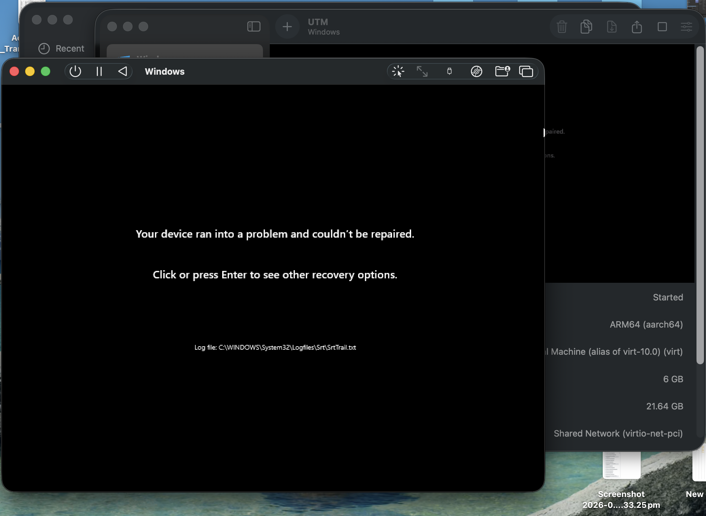
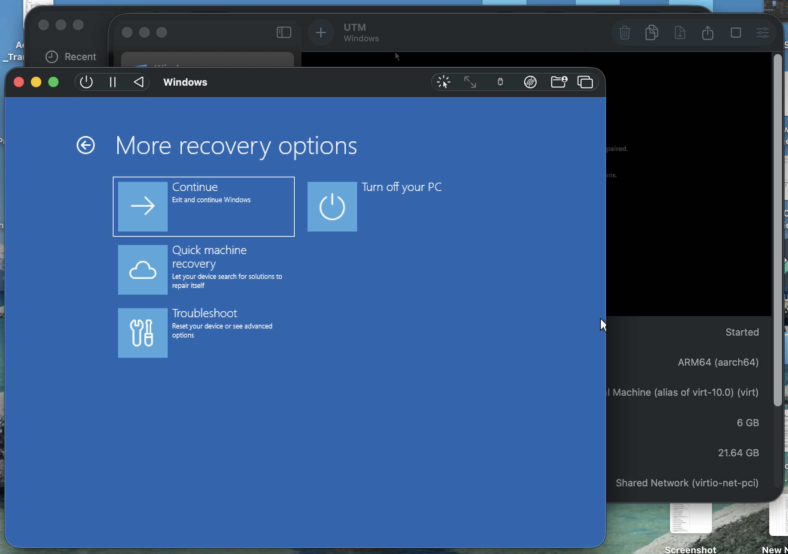
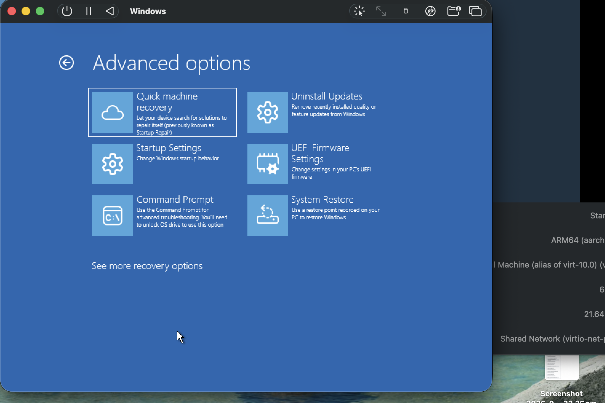
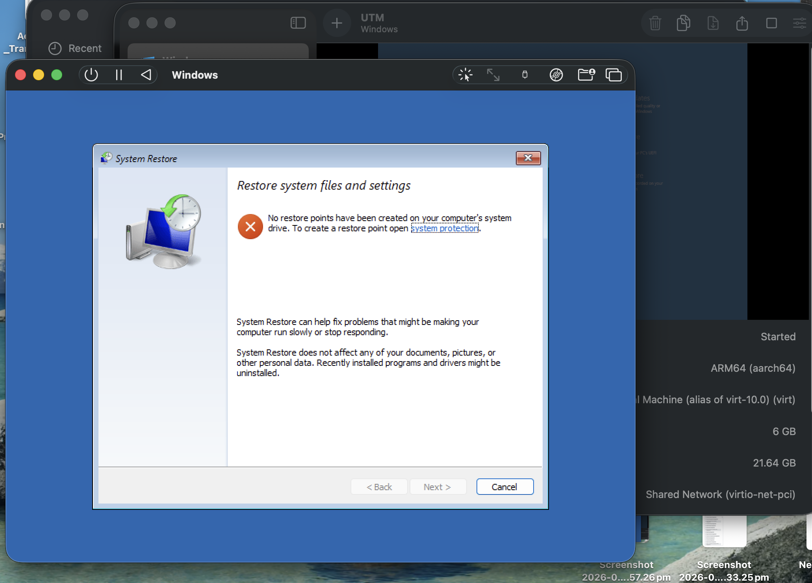
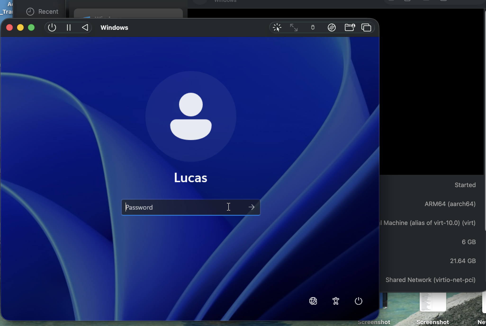
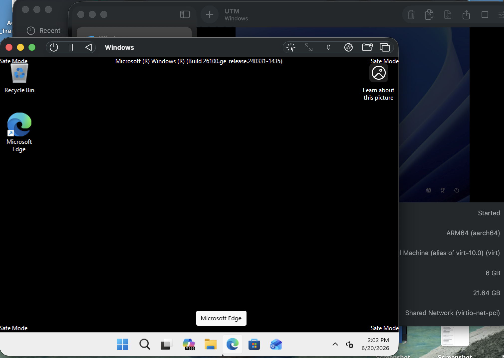
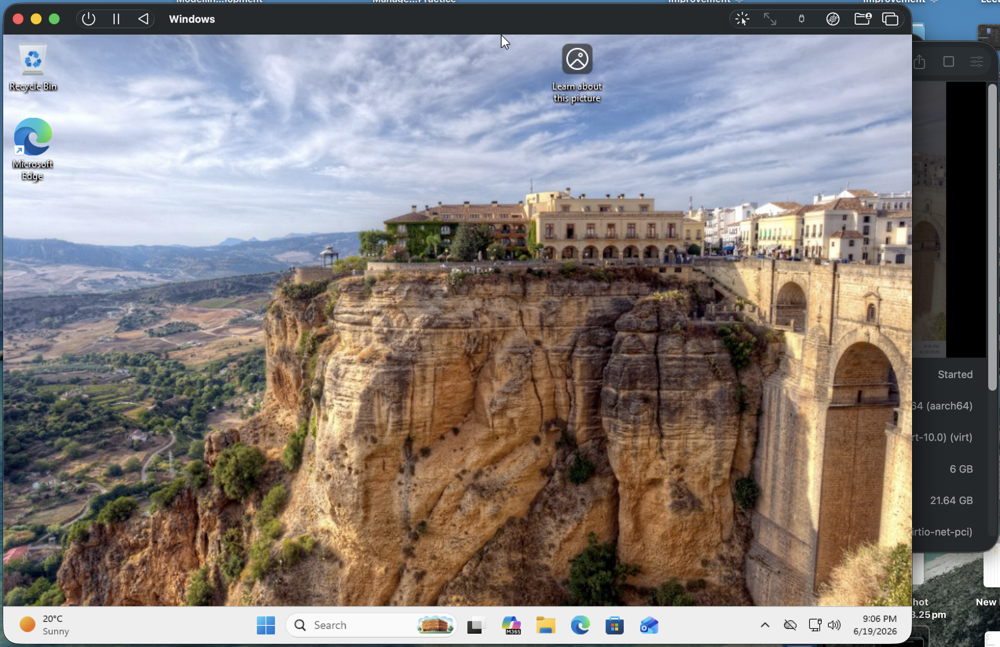

# Day 2 - VM Troubleshooting and Recovery

## Objective

Verify Windows 11 VM functionality and prepare the environment for future home lab development.

---

## Tasks Completed

- Booted Windows 11 ARM virtual machine in UTM.
- Verified successful login to Windows.
- Confirmed network connectivity and desktop functionality.
- Reviewed VM configuration and storage allocation.

---

## Issue Encountered

### Windows Startup Failure

Upon starting the virtual machine, Windows entered the Automatic Repair environment and displayed:

"Your device ran into a problem and couldn't be repaired."

Log file referenced:

C:\Windows\System32\Logfiles\Srt\SrtTrail.txt

---

## Troubleshooting Process

1. Entered Windows Recovery Environment.

2. Opened Troubleshoot, then Advanced Options.

3. Attempted Quick Machine Recovery, then System Restore.
4. System Restore was unavailable because no restore points had been configured.

5. Opened Startup Settings.
6. Restarted into Safe Mode.

7. Successfully logged into Windows in Safe Mode.

8. Performed a normal restart.

---

## Resolution

After booting into Safe Mode and restarting normally, Windows successfully loaded without entering Automatic Repair.

---

## Lessons Learned

- Safe Mode can be used to recover from startup issues.
- Recovery options such as System Restore require restore points to be configured beforehand.
- Proper shutdown procedures are important to reduce the likelihood of boot issues.

---

## Prevention

To avoid similar startup and recovery issues in the future:

1. Shut down Windows using:
   Start (Windows Logo Button) → Power → Shut Down

2. Wait for the virtual machine to fully power off before closing UTM.

3. Avoid:
   - Force quitting UTM
   - Closing the VM while Windows is running
   - Putting the host computer to sleep during Windows updates or shutdown

Following these steps helps prevent filesystem corruption and unexpected startup repair issues.

---

## Result

Windows 11 ARM VM is operational and ready for the next phase of the home lab.

---

## Next Steps

- Install Windows Server.
- Configure Active Directory.
- Create users and groups.
- Build internal lab network.
- Document all configuration changes.