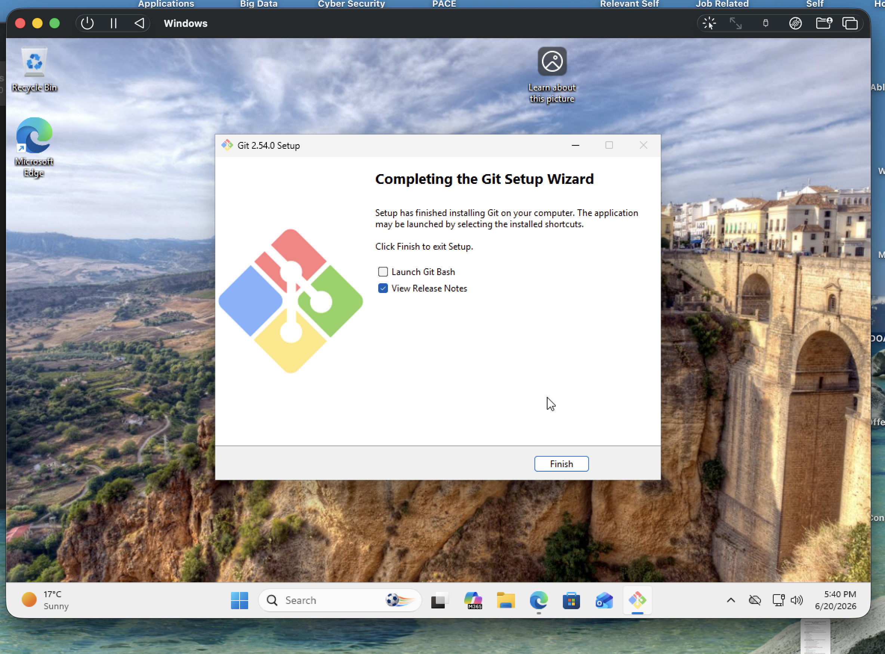
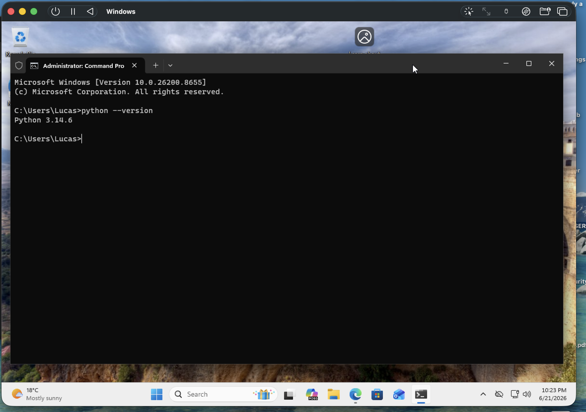
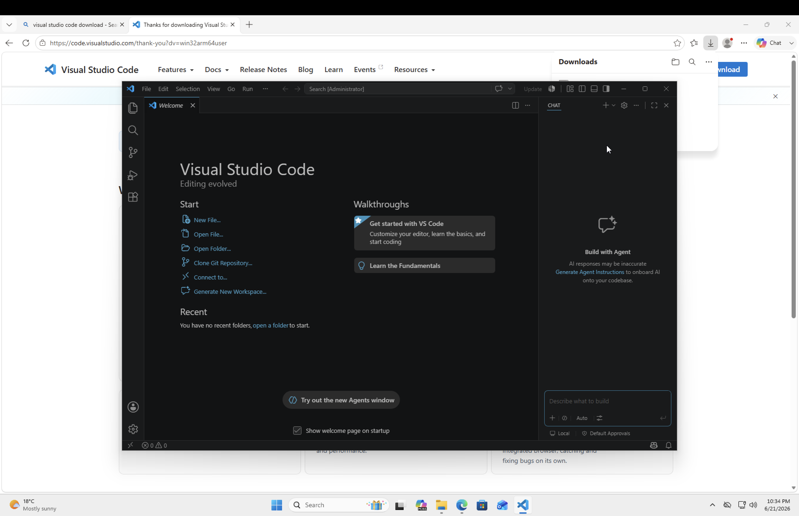
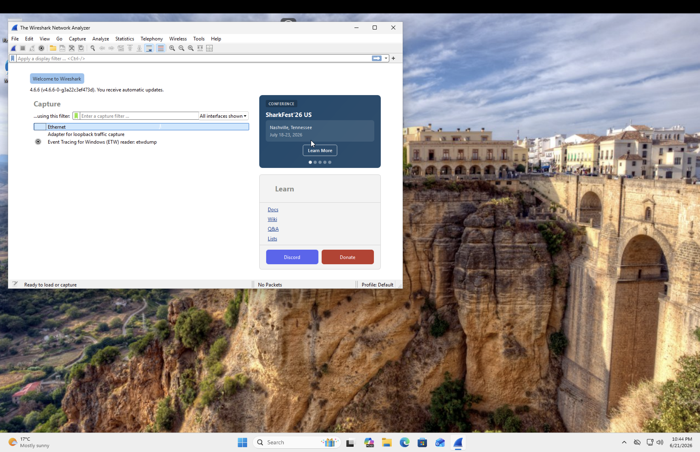
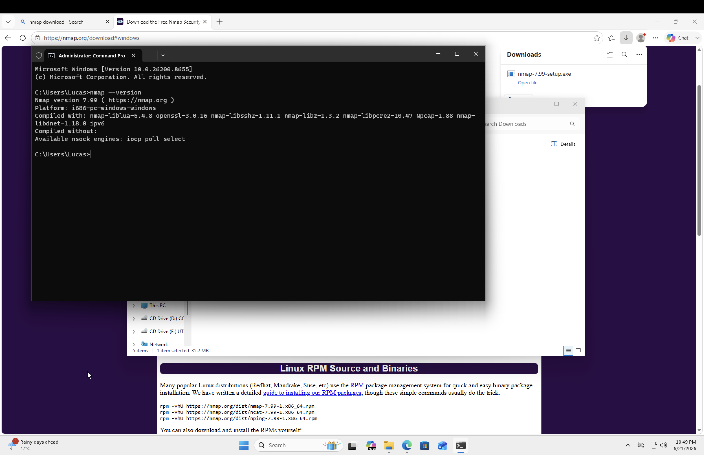

# Day 3 - Cybersecurity Tool Installation

## Objective

Prepare the Windows 11 VM for cybersecurity learning, networking analysis, and future home lab activities.

## Tools Installed

### Git

Purpose:
Version control and GitHub integration.

### Python

Purpose:
Scripting, automation, and cybersecurity tooling.

### Visual Studio Code

Purpose:
Code editing and project development.

### Wireshark

Purpose:
Network traffic capture and analysis.

### Nmap

Purpose:
Network discovery and port scanning.

## Verification

Successfully launched all applications and verified installations.

## Result

Windows VM is configured with core cybersecurity tools and ready for networking and security projects.

## Next Steps

* Learn Linux administration basics
* Create Linux users and groups
* Practice Linux networking and permissions
* Research Windows Server options for Apple Silicon
* Install Windows Server and Active Directory
* Join Windows 11 client to the domain