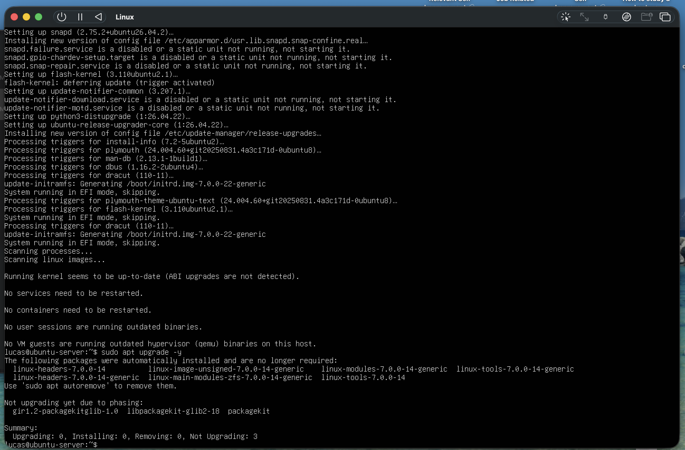
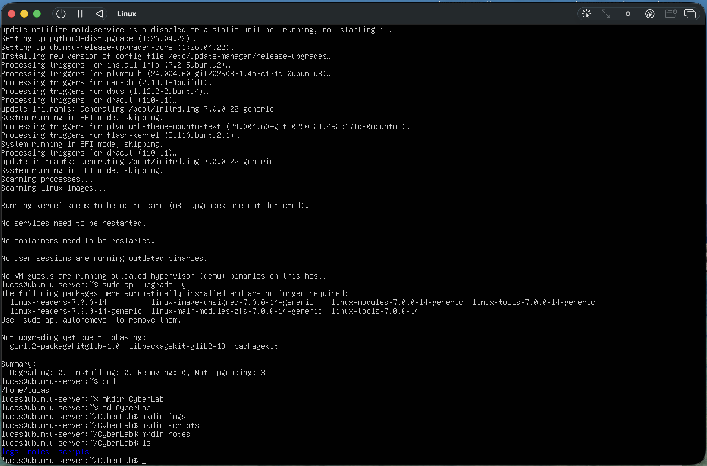
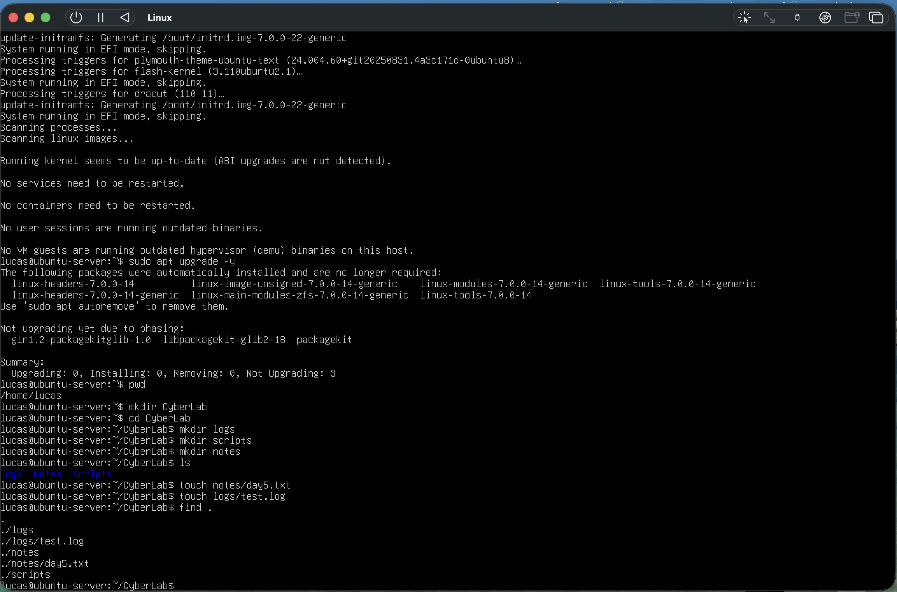
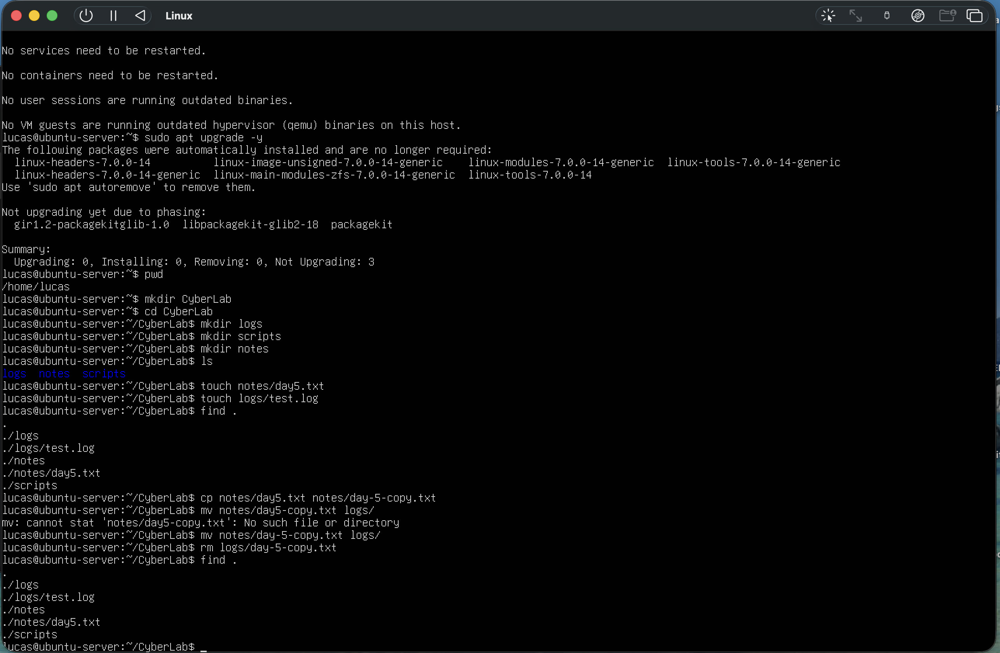
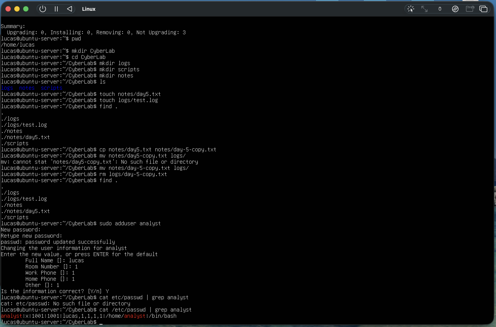
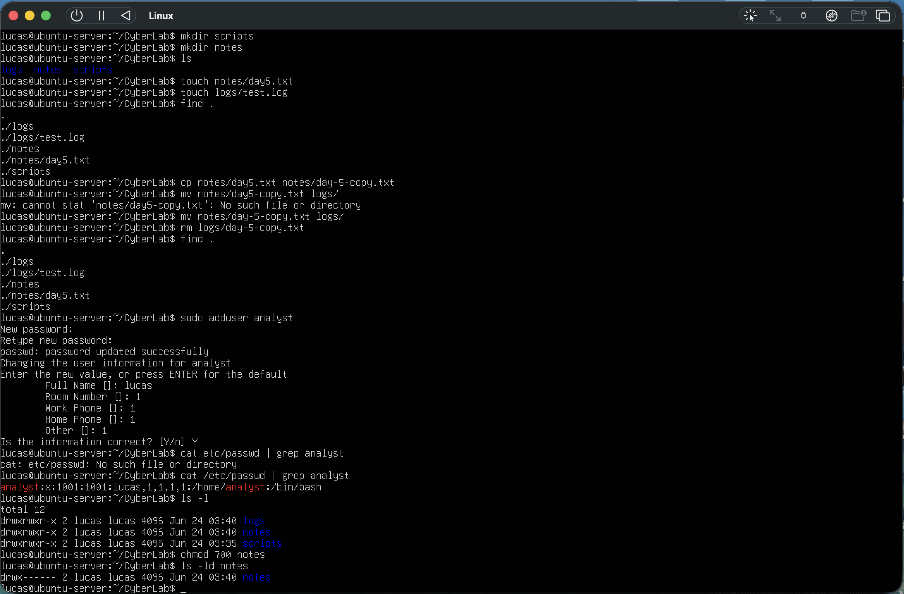
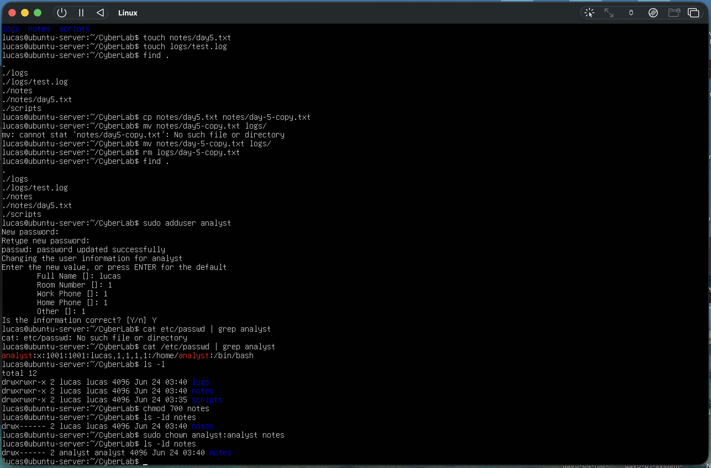
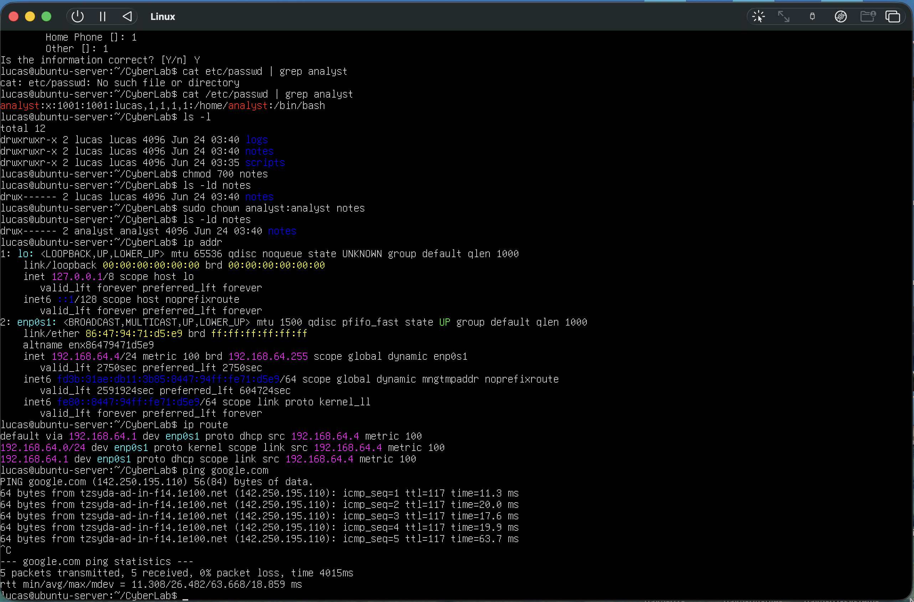
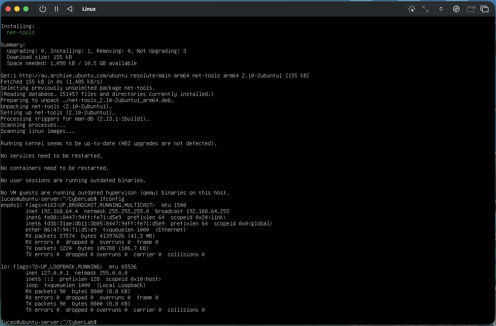

# Day 5 – Linux Administration Fundamentals

## Objective

The objective of this lab was to develop foundational Linux administration skills using an Ubuntu Server virtual machine. Tasks focused on system maintenance, directory and file management, user administration, permissions, networking, and command-line operations commonly used in cybersecurity and system administration environments.

---

## System Update

The Ubuntu Server system was updated to ensure the latest security patches and software packages were installed.

Commands used:

```bash
sudo apt update
sudo apt upgrade -y
```

The update completed successfully and confirmed that the system could communicate with Ubuntu repositories over the network.



---

## Directory Management

A dedicated lab workspace was created to organize files and practice Linux directory operations.

Commands used:

```bash
mkdir CyberLab
cd CyberLab

mkdir logs
mkdir scripts
mkdir notes
```

The directory structure was verified using:

```bash
ls
```

This demonstrated the ability to create and navigate directories within the Linux filesystem.



---

## File Operations

Several file management operations were performed to practice creating, copying, moving, and deleting files.

Commands used:

```bash
touch notes/day5.txt
touch logs/test.log

cp notes/day5.txt notes/day5-copy.txt

mv notes/day5-copy.txt logs/

rm logs/day5-copy.txt
```

The directory contents were verified using:

```bash
find .
```

These activities reinforced basic Linux file handling skills.





---

## User Management

A new user account was created to practice Linux user administration.

Command used:

```bash
sudo adduser analyst
```

Verification:

```bash
cat /etc/passwd | grep analyst
```

The account was successfully created and added to the system.



---

## Permissions and Ownership

Linux file permissions and ownership were explored to understand access control mechanisms.

Permissions were modified using:

```bash
chmod 700 notes
```

Verification:

```bash
ls -ld notes
```

Ownership was changed using:

```bash
sudo chown analyst:analyst notes
```

Verification:

```bash
ls -ld notes
```

These exercises demonstrated how Linux controls access to files and directories through permissions and ownership.





---

## Networking

Basic network information was examined to verify connectivity and identify system network settings.

Commands used:

```bash
ip addr
```

```bash
ip route
```

```bash
ping google.com
```

The Ubuntu VM successfully obtained an IP address through DHCP and was able to communicate with external hosts, confirming network functionality.



---

## Tools Installed

The following package was installed:

```bash
sudo apt install net-tools -y
```

The installation was verified using:

```bash
ifconfig
```

This provided additional networking utilities commonly used in Linux administration.



---

## Lessons Learned

* Linux administration is primarily performed through the command line.
* File and directory management are fundamental system administration skills.
* Linux permissions and ownership provide granular access control.
* User accounts can be managed using built-in administration commands.
* Network configuration can be verified using commands such as `ip addr` and `ip route`.
* Package management is performed using the APT package manager.
* Proper shutdown procedures help maintain VM stability and prevent filesystem corruption.

---

## Outcome

Successfully completed Linux administration fundamentals within the Ubuntu Server virtual machine.

Achievements included:

* Updating the operating system
* Creating and managing directories
* Performing file operations
* Creating a new user account
* Modifying permissions and ownership
* Verifying network connectivity
* Installing additional networking tools
* Practicing safe Linux administration procedures

The Ubuntu Server VM is now ready for more advanced Linux, networking, and cybersecurity lab activities.


