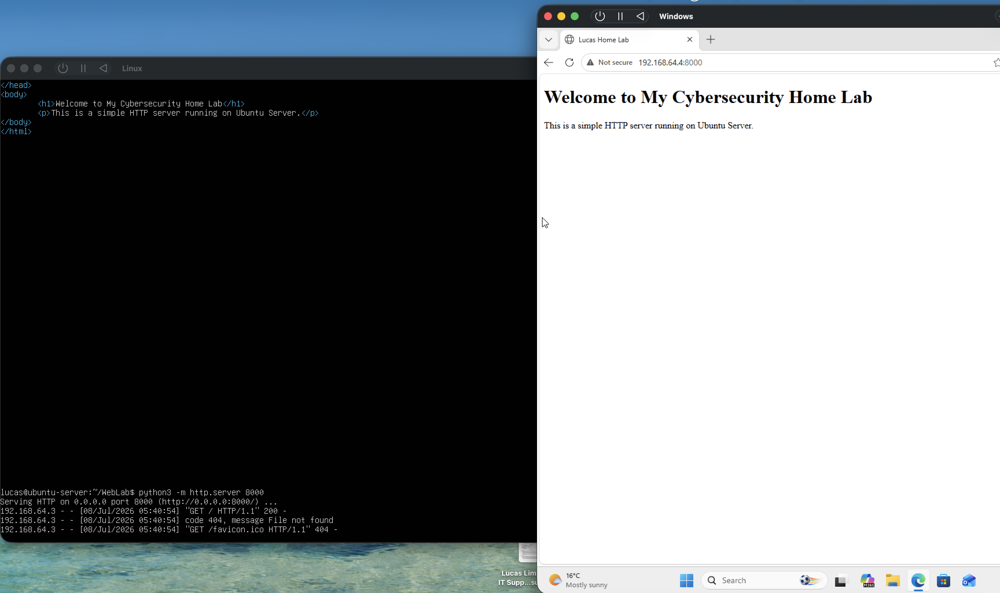
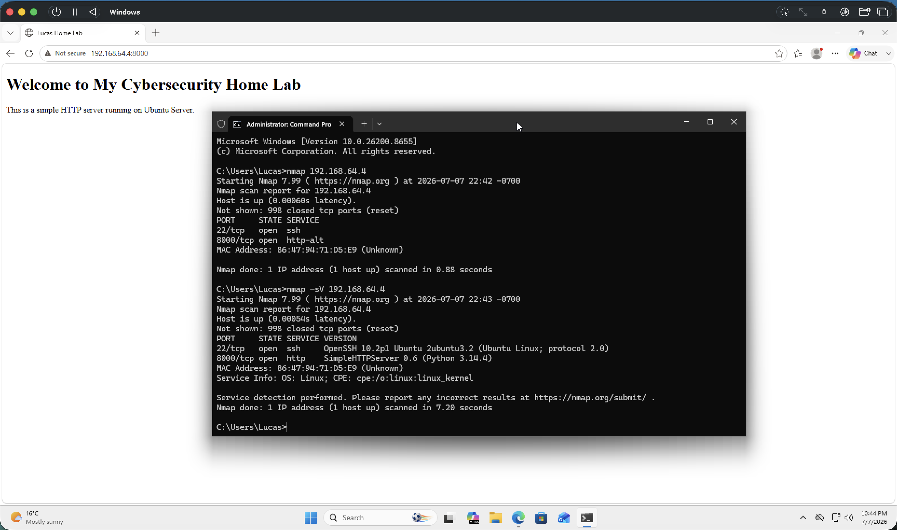
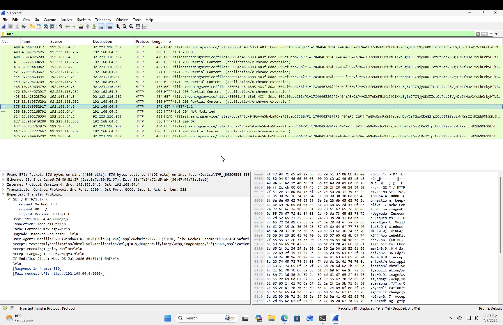
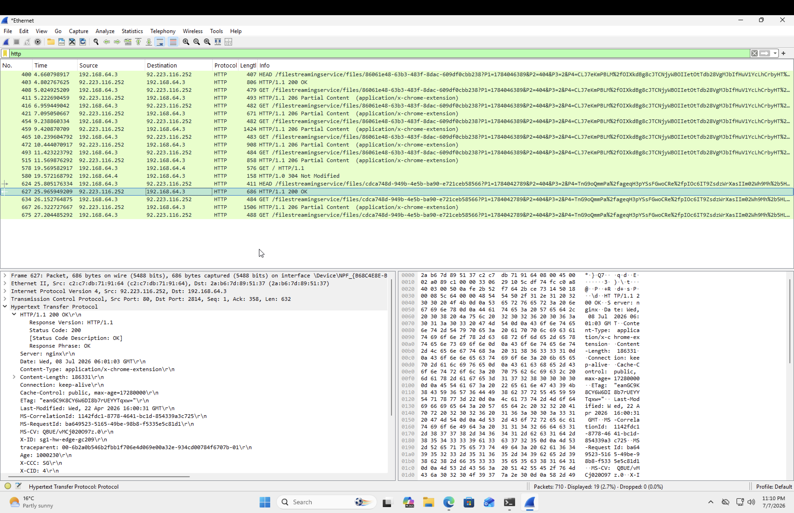
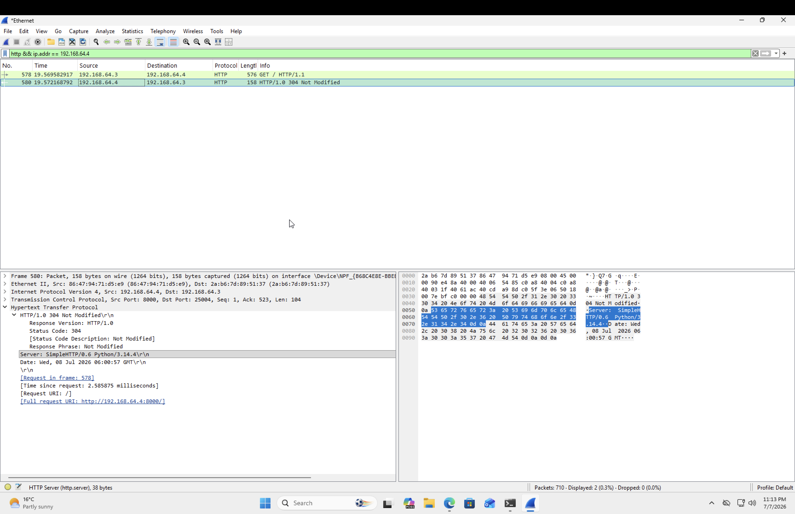
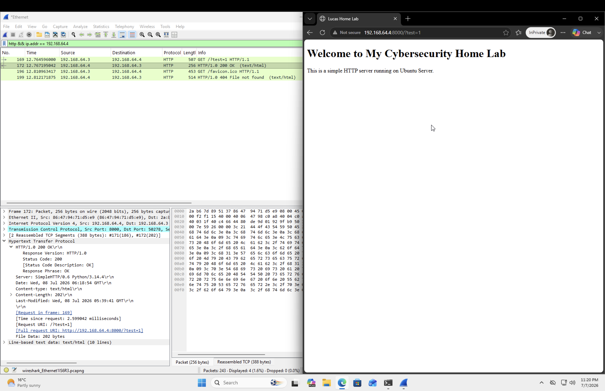
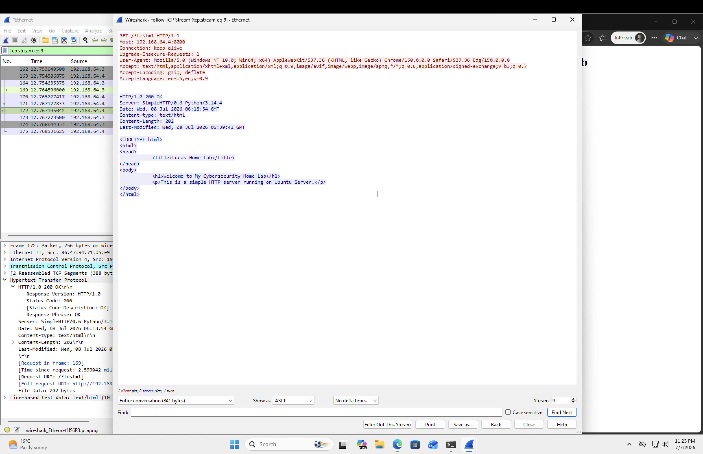

# Day 9 – HTTP Traffic Analysis with Wireshark

## Objective

The goal of this lab was to understand how HTTP traffic works by creating a simple web server, accessing it from another machine, capturing the traffic with Wireshark, and analysing the HTTP requests and responses.

---

## Lab Environment

- Host Machine: Windows 11
- Virtual Machine: Ubuntu Server
- Web Server: Python SimpleHTTPServer
- Protocol: HTTP
- Network Analysis Tool: Wireshark
- Port: 8000

---

## Steps Completed

### 1. Started a Local HTTP Server

Created a simple web page (`index.html`) and started a Python HTTP server.

Command:

```bash
python3 -m http.server 8000
```

The webpage was successfully accessed from the Windows host using:

```
http://192.168.64.4:8000
```

---

### 2. Verified the Service

Used Nmap to verify that the HTTP service was accessible.

Commands:

```bash
nmap 192.168.64.4
```

```bash
nmap -sV 192.168.64.4
```

Results:

- Port 8000 detected as open
- Service identified as Python SimpleHTTPServer
- SSH service also detected on port 22

---

### 3. Captured HTTP Traffic

Started a packet capture in Wireshark.

Applied the display filter:

```
http
```

Captured:

- HTTP GET request
- HTTP 200 OK response
- HTTP headers
- Browser request information

---

### 4. Examined the HTTP Request

The GET request showed:

- Request Method: GET
- HTTP Version: HTTP/1.1
- Host header
- User-Agent
- Accept headers

This demonstrates exactly what the browser sends to the server when requesting a webpage.

---

### 5. Examined the HTTP Response

The response contained:

- HTTP/1.0 200 OK
- Server: SimpleHTTP/0.6 Python/3.14.4
- Content-Type: text/html
- Content-Length
- Date
- Last-Modified

These headers describe the server and the webpage being returned to the client.

---

### 6. Followed the TCP Stream

Used:

```
Right Click → Follow → TCP Stream
```

This reconstructed the full HTTP conversation, including:

- HTTP GET request
- HTTP response headers
- Complete HTML source code

This demonstrated that HTTP traffic is transmitted in plaintext.

---

## Key Concepts Learned

- HTTP is an unencrypted application-layer protocol.
- A browser sends an HTTP GET request to request a webpage.
- The server responds with an HTTP status code and webpage contents.
- Wireshark can reconstruct complete HTTP conversations.
- The Follow TCP Stream feature makes it easy to inspect application-layer data.
- Nmap can identify running services and their versions.

---

## Skills Practised

- Hosting a Python HTTP server
- Capturing packets with Wireshark
- Filtering HTTP traffic
- Analysing HTTP requests
- Analysing HTTP responses
- Following TCP streams
- Service enumeration with Nmap

---

## Screenshots

### HTTP Server Running



---

### Nmap Service Detection



---

### HTTP GET Request



---

### HTTP 200 OK Response



---

### HTTP 304 Not Modified Response



> While testing, the browser initially returned a **304 Not Modified** response due to caching. Opening the webpage in an Incognito window forced a fresh request and produced a new **200 OK** response.

---

### HTTP 200 OK Response from Local Server



---

### Follow TCP Stream



---

## Reflection

This lab helped me understand the complete lifecycle of an HTTP request. I observed how a browser sends a GET request, how the server responds with status codes and headers, and how the webpage content is transmitted in plaintext. I also encountered browser caching, which resulted in a 304 Not Modified response. By troubleshooting with an Incognito window, I generated a fresh request and successfully captured a full 200 OK response. Finally, using Wireshark's Follow TCP Stream feature demonstrated how HTTP conversations can be reconstructed, reinforcing why HTTPS is essential for protecting web traffic.